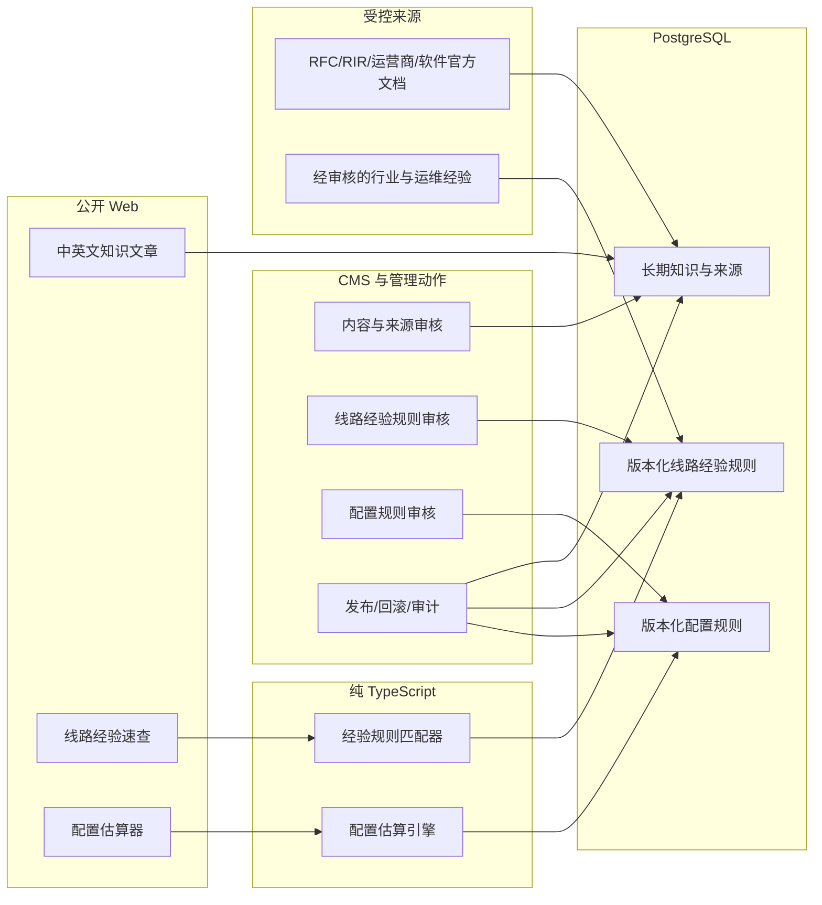

# 服务器知识库与经验选型完整实施方案

- 状态：最终版，作为后续实施与验收基线
- 日期：2026-08-02
- 仓库基线：`3f5bd20`
- 适用范围：知识内容 V3、来源治理、运营商线路经验指南、服务器配置估算、CMS、双语公开页面、AI、SEO、缓存、发布与回滚
- 前置规格：[服务器知识库中英双语实施规格](./server-knowledge-base-bilingual-spec.md)
- 本次修订：取消真实线路数据采集、探针、样本聚合和精确评分，线路建议改为有边界的行业经验判断；单台服务器的真实性能由用户购买前后自行测试

> 本文延续现有双语知识库，不替代已经落地的语言、翻译版本、卡片、发布和 AI 授权规则。发生冲突时，双语内容生命周期以原规格为准；新增的经验规则和配置估算能力以本文为准。

## 1. 最终结论

知识库下一阶段采用三个相互隔离的领域：

1. **长期双语知识内容**：继续使用现有 `knowledge_articles`，解释概念、经验判断、适用条件、反例、验证方法和失效边界。
2. **版本化线路经验规则**：把电信、联通、移动在不同地区、目标区域和业务场景下的常见线路经验整理为结构化规则，只输出定性建议和风险，不采集或伪造实时性能数据。
3. **版本化服务器配置规则**：根据 RPS、并发、响应体、数据规模、增长和 RPO/RTO 等输入估算资源范围；公式位于纯 TypeScript 引擎，结果包含计算依据和验证清单。

公开产品增加两个双语工具：

```text
/tools/network-lines
/en/tools/network-lines
/tools/server-sizing
/en/tools/server-sizing
```

其中 `/tools/network-lines` 是“线路经验速查”，不是测速平台、线路监控或商品排行榜。

以下边界冻结，不得在实施中自行改变：

- 不建设探针、目标 agent、测量活动、样本、聚合、线路评分快照或线路测量后台任务。
- 不调用 RIPE Atlas 等平台采集用于公开推荐的动态测量数据。
- 不接收、上传或保存用户针对单台服务器的 ping、MTR、traceroute、带宽测试结果。
- 不输出精确 RTT、丢包率、抖动、质量分、置信度分或“当前最快”结论。
- 不对具体商家、具体套餐或具体服务器作性能保证和购买排序。
- 线路经验只用于购买前缩小选择范围；具体服务器必须由用户使用测试 IP、Looking Glass 或购买后的实例自行验证。
- 商家宣传的 CN2、CMI、CUII、BGP、原生 IP 等标签只能作为线索，不能作为已验证事实。
- 中文源稿是双语事实源，英文译文不得新增独立事实。
- 服务器估算缺少压测或生产遥测时只返回范围，不伪造精确配置。
- 公共工具 V1 在浏览器内计算，不上传用户选择的地区/运营商、项目规模、RPS、数据量、RPO 或 RTO。
- 内容 V3、线路经验规则和配置估算规则分别发布，不能打包成一次生产变更。

## 2. 当前基线与问题

### 2.1 已经具备的能力

当前仓库已经完成：

- 30 个双语知识单元，共 60 篇中文源稿与英文译稿。
- 中文 `/knowledge` 与英文 `/en/knowledge` 列表、搜索、详情、相关推荐、SEO 和 sitemap。
- `definition`、`highlights`、`quickTip` 三句式卡片和安全渲染。
- 中文源稿、英文译稿、`contentRevision`、`translatedFromRevision` 和同步发布门槛。
- 发布、取消发布、AI 授权、乐观锁、事务和防覆盖校验。
- 已发布且明确授权的分语言 AI 知识检索。
- 服务器线路分类 `server_network_lines`，已有 `slug`、中英文名称、别名和启用状态，可作为经验规则引用的线路族目录。
- `knowledge.changed` 缓存事件和知识内容校验脚本。

现有关键文件：

```text
packages/db/schema.ts
src/server/knowledge/service.ts
src/features/cms/actions/knowledge.ts
src/features/cms/components/knowledge-manager.tsx
src/features/public/data/knowledge.ts
src/features/public/components/knowledge-card.tsx
packages/ai/knowledge-retrieval.ts
packages/cache/tags.ts
scripts/knowledge/initial-bilingual-content.ts
scripts/publish-initial-bilingual-knowledge.ts
```

### 2.2 当前内容缺口

现有知识内容结构已经正确，但多数文章仍偏通用解释：

- 用户知道“要测试”，却不知道在电信、联通、移动场景下应优先了解哪些线路族。
- CN2 GIA、CN2 GT、163、CMI、CMIN2、CUII、AS9929、AS4837、BGP 等名词分散，缺少统一的经验矩阵。
- 缺少“该经验为什么可能成立、什么时候不成立、购买后怎么验证”的完整闭环。
- 核心配置文章没有把 RPS、响应时间、数据量、增长和 RPO/RTO 映射到资源范围。
- 来源目前以 `sourceNotes` 长文本为主，缺少结构化来源、引用范围、复核日期和历史 revision。
- 部分来源需要更新；旧的中国电信产品 URL 已失效，联通线路文章缺少官方一手资料。

因此，下一步不是建设网络测量系统，而是把现有 30 个单元升级为“经验明确、边界明确、验证明确”的决策知识，并用两个本地工具承接结构化规则。

## 3. 目标、非目标与成功指标

### 3.1 产品目标

用户完成一次知识查询或工具选择后，应得到：

- **线路场景**：根据所在地、运营商、目标区域和业务类型，了解通常优先关注的线路族、可接受替代、常见风险和单服务器验证步骤。
- **配置场景**：获得起步、推荐和高可用三档资源范围，知道计算依据、主要瓶颈、何时扩容以及如何压测和恢复演练。
- **文章场景**：理解名词边界、经验来源、反例、命令、恢复路径和复核日期，而不是只记住宣传名称。

### 3.2 工程目标

- 保持现有双语、SEO、缓存和 AI 行为向后兼容。
- 经验规则和配置规则使用版本、schema、引擎版本和 checksum，可审查、可回滚、可确定性测试。
- 所有 CMS 写入通过管理员会话、领域服务、事务、乐观版本和审计。
- 公共工具只读；计算在浏览器中执行，不保存用户输入。
- 规则逻辑可在无数据库、无 Next.js 的环境中做纯函数单元测试。
- 缺失、冲突、不支持和规则过期状态明确，不用默认值静默产生结论。

### 3.3 内容成功指标

- 30 个中文源稿和 30 个英文译稿全部升级到 V3，ID、slug、分类和配对关系不变。
- 每篇 V3 至少包含：输入条件、核心判断、常见经验、例外边界、用户验证方法、失效条件、来源和复核日期。
- `KB-002/006/007/009/011/030` 首批 6 个单元具备完整决策闭环。
- 线路文章不使用“某线路一定最好”“某地区固定多少毫秒”等绝对表达。
- 代表查询“电信线路”“移动回程”“联通跨境”“项目规模”“RPS”“RPO/RTO”能命中新内容。

### 3.4 工具成功指标

- 线路工具只输出 `usually_preferred | situational | usually_not_preferred | unknown` 等定性适配状态。
- 每个线路结果同时展示经验依据、适用条件、风险、复核日期和单服务器验证清单。
- 没有匹配规则或规则冲突时返回“经验不足/需要自行测试”，不硬凑推荐。
- 三网场景分别展示电信、联通、移动判断，不用平均分掩盖差异。
- 配置估算对同一输入、同一引擎和同一规则版本得到完全一致的输出与计算轨迹。
- 增加 RPS、数据量或增长不能降低资源建议；收紧 RPO/RTO 不能降低可靠性拓扑。
- 两个工具都不产生包含用户输入的网络请求。

### 3.5 非目标

- 不建设测速平台、Looking Glass、网络监控或线路质量数据库。
- 不维护实时路由、晚高峰、丢包、延迟或带宽数据。
- 不做云厂商或商家的实时比价、库存推荐和购买排序。
- 不根据用户 IP 自动识别并保存所在地或运营商；V1 由用户明确选择。
- 不保证经验规则适用于任何具体商家套餐、IP 前缀、机房或购买时间。
- 不让 AI 自动发布文章、线路经验规则或配置规则。
- 不用通用估算器覆盖 GPU/AI 训练、实时音视频、高频交易和主动多地域等专项架构。
- 不在 V1 保存公共用户的估算历史、线路选择条件或精确业务规模。
- 不在本方案任务中执行生产迁移、生产内容写入、部署、提交或推送。

## 4. 用户输入与决策输出

### 4.1 线路经验速查

V1 输入：

| 维度     | 值                                 | 说明                                 |
| -------- | ---------------------------------- | ------------------------------------ |
| 用户地区 | 省份或华北、华东、华南等预定义区域 | 只做粗粒度经验匹配，不自动定位       |
| 运营商   | 电信、联通、移动、三网用户         | 三网用户分别展示三家结果             |
| 接入类型 | 家庭宽带、企业宽带、移动网络、未知 | 经验不足时保留 unknown               |
| 目标地区 | 香港、日本、新加坡、美国西部、其他 | 不接受 IP、URL 或域名                |
| 业务类型 | Web/API、实时交互、下载、后台任务  | 影响经验适配，不改变任何真实网络数据 |

V1 输出：

- 通常优先关注的线路族和可接受替代。
- 每个线路族的定性适配状态、常见优势、常见风险和适用条件。
- 经验依据强度：`established | common | limited`，明确它不是当前性能置信度。
- “为什么可能适合”和“为什么可能不适合”的双向解释。
- 商家标签、实际路由和交付前缀可能不一致的提示。
- 购买前索取测试 IP/Looking Glass 的问题清单。
- 购买后按用户自己的网络进行测试的命令、时段和验收清单。
- 规则版本、复核日期和相关知识文章。

工具不得输出：

- 精确延迟、丢包、带宽、质量分或置信度分。
- “当前最快”“全国最优”“一定适合”等保证。
- 具体商家或套餐的自动购买结论。
- 未经用户测试的具体服务器性能结论。

### 4.2 服务器配置估算器

V1 输入分为六组：

1. 工作负载：静态站点、CMS/CRUD、API/SaaS、交易电商、批处理或自定义。
2. 流量：平均/峰值 RPS、动态比例、边缘缓存命中率、突发系数、响应时间、响应体大小和长连接数。
3. 实测：CPU 每请求耗时、峰值 RSS、每在途请求内存、压测断点和测试环境。
4. 数据：在线数据量、月增长、规划周期、数据库类型、连接数和 Redis 峰值。
5. 可靠性：可用性目标、RPO、RTO、故障备用实例和备份要求。
6. 运维能力：是否允许托管服务、团队能力和部署限制。

输出固定为：

- `start`：开发、试运行或非关键业务的最低可行范围。
- `recommended`：保留增长和运行余量的生产建议。
- `ha`：满足已声明可靠性目标的拓扑；证据不足时只给验证前提，不承诺目标。
- 标准化输入、资源范围、计算轨迹和稳定 `formulaId`。
- CPU、内存、存储、网络、数据库连接和副本数中的主要瓶颈。
- 假设、警告、缺失证据、不支持原因、扩容触发器和验证/恢复演练清单。
- `baseline | calibrated | validated` 三档置信度及各维度证据。

### 4.3 文章与工具的关系

- 文章负责回答“为什么、通常如何、什么情况下例外、怎么验证”。
- 工具负责把受控输入匹配到结构化经验规则或配置公式。
- 工具结果必须链接到解释关键规则的文章。
- 文章不得复制某个具体商家或服务器的短期结论为长青事实。
- 卡片只保留稳定定义、2-3 个要点和一条速查，不承载工具运行结果。

## 5. 总体架构



系统明确不包含：

```text
探针
目标 agent
网络测量任务
原始样本
聚合 rollup
线路评分快照
线路推荐 POST API
用户测速结果上传
```

### 5.1 分层边界

| 层                    | 责任                                      | 禁止事项                              |
| --------------------- | ----------------------------------------- | ------------------------------------- |
| `packages/core`       | 输入校验、纯匹配、公式、reason code、版本 | 导入数据库、Next.js、React 或环境变量 |
| `packages/db`         | schema、关系、约束和索引                  | 承担匹配算法或 UI 本地化              |
| `src/server`          | 事务、规则读取、发布、回滚和审计          | 采集或执行网络命令                    |
| `src/features/public` | 只读加载、客户端计算、本地化、UI 和 SEO   | 保存用户输入或写入规则                |
| CMS                   | 内容、来源、经验规则和配置规则的审核      | 编辑 JavaScript、SQL 或任意表达式     |

### 5.2 三种版本空间

- 知识内容：`contentRevision` 与 `translatedFromRevision`。
- 线路经验：`engineVersion`、`schemaVersion`、`ruleSetVersion` 与 `checksum`。
- 配置估算：`engineVersion`、`schemaVersion`、`ruleSetVersion` 与 `checksum`。

三种版本互不代替。文章修改不自动改变规则；规则修改不静默改写文章；英文始终与中文事实 revision 对齐。

## 6. 来源与经验治理

### 6.1 来源等级

| 等级 | 类型                                   | 用途                                         |
| ---- | -------------------------------------- | -------------------------------------------- |
| A    | RFC、RIR、软件官方文档、运营商官方定义 | 协议、字段、命令和产品公开定义               |
| B    | 云厂商架构文档、官方教程、公开 SLA     | 架构方法、运维边界和已声明能力               |
| C    | 高质量社区教程、公开技术分析           | 操作步骤和交叉核验                           |
| D    | 团队过往经验、行业常见经验             | 定性线路适配和风险提示，必须显式标为经验判断 |

治理规则：

- 产品名、协议和命令优先引用 A/B 级来源。
- “电信通常更适合关注 CN2”“移动通常优先关注 CMI/CMIN2”等适配结论属于 D 级经验，不能伪装成运营商官方保证。
- D 级经验必须记录作者、复核人、适用范围、反例、复核日期和用户验证步骤。
- 单一论坛帖子、广告页、商家宣传或匿名截图不能直接成为公开规则。
- 经验一致性高不等于具体服务器性能高。
- 来源失效时阻止重新发布相关规则，并在 CMS 中告警；已经公开的页面进入待复核状态，但不自动改成相反结论。

### 6.2 结构化来源表

新增 `knowledge_sources`，保存稳定身份和当前 revision 指针：

```text
id, sourceKey, kind, authorityTier, currentRevisionId,
reviewDueAt, validUntil, status, notes, createdAt, updatedAt
```

新增不可变 `knowledge_source_revisions`：

```text
id, sourceId, revision, publisher, title, canonicalUrl,
publishedAt, retrievedAt, contentHash, metadataJson, changeReason,
createdBy, createdAt
```

新增 `knowledge_article_sources`：

```text
articleId, sourceRevisionId, citationKey, claimScope,
sortOrder, createdAt
```

关键约束：

- `sourceKey` 全局唯一且稳定；URL 变更不改变 key。
- `(sourceId, revision)` 唯一；已被引用的 revision 不可编辑。
- `kind` 至少包含 `protocol | operator_official | software_official | architecture | community | editorial_experience`。
- `canonicalUrl` 只有 `editorial_experience` 可以为空；此类 revision 必须保存经审核的内部经验摘要 hash、作者、复核人和适用范围，公开页面只展示“编辑经验”和复核日期，不泄露内部备注。
- 标题、URL、发布者、内容 hash 或检索时间变化时创建新 revision。
- 中英文配对发布前，使用的 `citationKey` 集合必须一致；英文 `claimScope` 只翻译中文主张。
- 来源新 revision 不自动改变历史文章或规则；必须显式复核并发布新内容/规则 revision。
- `status` 为 `active | superseded | broken | retired`。

### 6.3 首批来源目录

网络与路由：

- [RFC 4271: BGP-4](https://www.rfc-editor.org/info/rfc4271/)
- [APNIC RDAP](https://www.apnic.net/about-apnic/whois_search/about/rdap/)
- [RouteViews](https://www.routeviews.org/routeviews/)
- [RIPE RIS](https://ris.ripe.net/)
- [PeeringDB Documentation](https://docs.peeringdb.com/)
- [China Telecom Global Internet Access](https://www.chinatelecomglobal.com/expertises/productservices/2457/2496)
- [China Telecom Global Transit](https://www.chinatelecomglobal.com/expertises/productservices/2457/2497)
- [China Mobile International Internet Services](https://www.cmi.chinamobile.com/en/solutions/internet-services/)
- [China Unicom Global IP Transit and Peering](https://eu.chinaunicomglobal.com/products-ipt-and-peering)

这些来源用于定义和背景，不用于证明某台服务器当前质量。RouteViews/RIS 只作为文章中的人工查询工具，不接入后台采集。

容量与可靠性：

- [AWS Well-Architected Performance Efficiency](https://docs.aws.amazon.com/wellarchitected/latest/performance-efficiency-pillar/welcome.html)
- [Google Cloud Performance Optimization](https://docs.cloud.google.com/architecture/framework/performance-optimization)
- [Google SRE: Handling Overload](https://sre.google/sre-book/handling-overload/)
- [PostgreSQL Resource Consumption](https://www.postgresql.org/docs/current/runtime-config-resource.html)
- [Kubernetes Resource Management](https://kubernetes.io/docs/concepts/configuration/manage-resources-containers/)
- [k6 Load Testing](https://grafana.com/docs/k6/latest/testing-guides/load-testing-websites/)

操作类文章继续补充 NGINX、OpenSSH、Docker、Let's Encrypt、Linux 发行版、systemd、IANA 和安全机构的一手文档。

### 6.4 可借鉴知识库及方法

| 参考库                               | 借鉴内容                           | 不能照搬的部分                   |
| ------------------------------------ | ---------------------------------- | -------------------------------- |
| AWS Well-Architected                 | 按工作负载提问、权衡、风险和改进项 | AWS 产品绑定和 SKU 结论          |
| Google Cloud Architecture Framework  | 目标、原则、评估问题和验证闭环     | GCP 独有服务映射                 |
| Google SRE Book                      | SLO、容量、过载、监控和恢复演练    | 大型组织流程原样套给小团队       |
| Cloudflare Learning Center           | 分层解释 DNS、BGP、TLS、DDoS       | 产品营销和未经交叉核验的效果主张 |
| DigitalOcean Community Tutorials     | 前置条件、步骤、验证和回滚         | 未核对版本的第三方结论           |
| Akamai/Linode Docs                   | VPS 初始化、网络、备份和排障结构   | 平台专属控制台步骤               |
| Ubuntu Server / Red Hat Docs         | 发行版命令、安全和生命周期边界     | 跨发行版直接复制命令             |
| NGINX/PostgreSQL/Kubernetes 官方文档 | 参数语义、版本化配置和官方警告     | 把示例参数当作所有环境的最佳值   |

借鉴信息架构和验证方法，不批量搬运文案、教程正文或图表。

## 7. 知识内容 V3

### 7.1 正文模板

每篇 V3 使用以下结构；不适用的段落可以合并，但不能缺少决策和边界：

1. **一句话结论**：这篇知识解决什么问题。
2. **先确认输入**：地区、运营商、业务、规模、版本或权限。
3. **核心判断**：协议事实、常见经验和明确规则分开写。
4. **场景矩阵/步骤**：帮助用户快速定位。
5. **通常适合/不适合**：同时写反例和例外。
6. **如何验证**：查询、命令、测试 IP、压测或恢复演练。
7. **失效条件**：产品、路由、软件版本或业务变化后何时重查。
8. **来源与复核日期**：官方来源和经验复核人分开列出。

卡片继续使用：

```text
definition：1 句稳定定义
highlights：2-3 条稳定要点
quickTip：1 条可执行速查
```

`summary` 不从 schema 删除；卡片不展示它，但详情页导语和 SEO 仍可使用经过压缩的摘要。

### 7.2 首批 6 个决策单元

| 单元   | V3 核心补充                                                   | 工具关系           |
| ------ | ------------------------------------------------------------- | ------------------ |
| KB-002 | 从负载输入推导 CPU、内存、存储、网络和副本范围                | 配置估算器         |
| KB-006 | AS4134/AS4809、CN2/GIA/GT 的名词边界与电信常见经验            | 线路经验速查       |
| KB-007 | 移动 CMI/CMIN2、联通 CUII/AS9929/AS4837 的常见经验与例外      | 线路经验速查       |
| KB-009 | 用户针对单台服务器执行 ping/MTR/traceroute/TCP/TLS 测试的指南 | 线路工具验证清单   |
| KB-011 | 地区 × 运营商 × 目标地区 × 业务类型的经验矩阵                 | 线路经验速查主入口 |
| KB-030 | 个人站、企业站、电商、API 和批处理的规模与可靠性              | 配置估算器         |

### 7.3 30 个单元发布波次

| 波次       | 单元                                           | 记录数 | 目标                          |
| ---------- | ---------------------------------------------- | -----: | ----------------------------- |
| A 决策试点 | KB-002、006、007、009、011、030                |     12 | 线路经验与配置估算闭环        |
| B 扩展决策 | KB-001、003、005、010、012、013、014、015、029 |     18 | 产品、指标、地区和监控        |
| C 基础概念 | KB-004、008、016、017、019、027                |     12 | 虚拟化、专线、IP、DNS 和 DDoS |
| D 操作排障 | KB-018、020-026、028                           |     18 | 查询、初始化、部署和故障恢复  |

### 7.4 V3 内容发布协议

V3 是内容发布，不是 schema migration，也不复用旧 `revise-v2`：

- 先冻结 60 条完整 V2 渲染快照和 SHA-256 清单。
- 新建 V2→V3 专用发布器；旧发布器保持不变供历史审计。
- 每个中英双语对在一个事务中锁定和更新。
- 事务内二次核对旧哈希、`contentRevision`、语言、分类和翻译关系。
- ID、slug、分类、翻译源、`published`、`publishedAt` 保持不变。
- 英文 `translatedFromRevision` 指向更新后的中文 revision。
- 更新开始先关闭该对 AI 引用；页面、SEO、缓存和同步验证通过后再显式开启。

生产差异状态：

| 状态              | 处理                                   |
| ----------------- | -------------------------------------- |
| `EXACT_V2`        | 允许升级                               |
| `EXACT_V3`        | 幂等跳过                               |
| `MANUAL_DIVERGED` | 整波停止，输出字段差异，人工吸收或排除 |
| `MISSING`         | 停止，不自动补建                       |
| `PAIR_BROKEN`     | 停止，单独修复关系                     |
| `STATE_BLOCKED`   | 停止，修复发布、AI 或版本状态          |
| `SCHEMA_DRIFT`    | 停止，先修复迁移基线                   |

额外的非受管知识条目不参与 V3 更新，也不得被发布器删除或改写。

### 7.5 内容版本历史

V3 首次发布使用仓库快照回滚。后续 Decision foundation migration 新增：

```text
knowledge_article_versions:
id, articleId, contentRevision, documentJson,
sourceSetJson, sourceSetHash, reason, createdBy, createdAt
```

- `(articleId, contentRevision)` 唯一。
- 版本保存所有影响公开渲染和翻译同步的字段。
- 恢复历史内容时创建新的 `contentRevision`，不能倒退版本号。
- 中文恢复后，英文仍按现有同步规则处理。

### 7.6 30 个单元改造矩阵

| ID     | V3 核心补充                                     | 必须产出的决策资产                |
| ------ | ----------------------------------------------- | --------------------------------- |
| KB-001 | VPS、云服务器、独立服务器的隔离、弹性和运维边界 | 选择矩阵、反例、升级条件          |
| KB-002 | CPU、内存、存储、网络从负载输入推导             | 公式、三个案例、配置估算器        |
| KB-003 | 带宽、流量、并发与响应体大小                    | Mbps/流量公式、突发与计费边界     |
| KB-004 | KVM、OpenVZ/LXC、VMware 的隔离与超售风险        | 能力矩阵、宿主争用验证            |
| KB-005 | HDD、SSD、NVMe 的延迟、IOPS、耐久和数据安全     | 工作负载矩阵、fio 安全测试边界    |
| KB-006 | 电信 AS4134/AS4809、CN2、GIA、GT                | 名词边界、电信经验、单机验证      |
| KB-007 | 联通、移动国际线路族和地区差异                  | 官方定义、常见经验、例外声明      |
| KB-008 | IPLC、IEPL、专线与公共互联网                    | 合同/SLA 核对表、隔离边界         |
| KB-009 | ping、MTR、traceroute 与单机测试                | 用户测试步骤、记录模板、判断边界  |
| KB-010 | BGP、前缀、AS_PATH 和去回程不对称               | 人工查询流程、RouteViews/RIS 示例 |
| KB-011 | 地区、运营商、目标机房和业务类型                | 经验矩阵、线路经验速查            |
| KB-012 | RTT、丢包、抖动、TCP/TLS/TTFB                   | 指标解释、业务影响、用户测试方法  |
| KB-013 | 香港机房、带宽、合规与大陆访问                  | 条件矩阵、经验边界、测试清单      |
| KB-014 | 日本与新加坡面向大陆/东南亚                     | 用户分布矩阵、路径例外            |
| KB-015 | 美国西部/东部与全球访问                         | 距离/路径矩阵、CDN 与源站边界     |
| KB-016 | IPv4、IPv6 和双栈                               | 能力矩阵、DNS/监听/防火墙验证     |
| KB-017 | 原生、广播、住宅 IP 市场标签                    | RDAP/ASN 核验、风控非保证声明     |
| KB-018 | ASN、RIR、RDAP 与网络归属                       | 结构化查询步骤、注册与路由差异    |
| KB-019 | A、AAAA、CNAME、TTL 和 DNS 发布                 | 记录矩阵、dig 验证、回滚计划      |
| KB-020 | IP 被封、端口不通、DNS 失败                     | 分层排障树、证据采集、升级路径    |
| KB-021 | 新 VPS Linux 初始化                             | 可勾选清单、验证命令、锁定前回退  |
| KB-022 | SSH 密钥、密码切换和失联风险                    | 双会话切换、sshd 校验、恢复通道   |
| KB-023 | Docker Compose 生产部署                         | 健康检查、日志、备份和回滚        |
| KB-024 | Nginx 反向代理、TLS 与续期                      | `nginx -t`、证书续期和恢复演练    |
| KB-025 | 数据库、文件和异地备份                          | RPO/RTO、3-2-1 和恢复演练         |
| KB-026 | 防火墙、最小权限和补丁                          | 分阶段加固、验证、避免锁死        |
| KB-027 | DDoS 清洗、高防和业务可用性                     | 威胁/容量矩阵、供应商问题清单     |
| KB-028 | 502、504、connection refused                    | 客户端到上游的排障树和恢复步骤    |
| KB-029 | CPU、内存、磁盘、证书与可用性告警               | 阈值来源、告警分级、runbook       |
| KB-030 | 个人站、企业站、电商、API 和批处理              | 输入到拓扑矩阵、三个案例、估算器  |

## 8. 运营商线路经验系统

### 8.1 定位与原则

线路模块不是评测系统，而是把团队过往经验整理为可审查、可解释、可本地匹配的知识规则。

每条经验必须同时回答：

1. 哪些用户条件下通常值得优先关注。
2. 为什么这种经验可能成立。
3. 哪些情况会让经验失效。
4. 用户购买前和购买后应如何验证具体服务器。

经验规则不得包含：

- 延迟、丢包、抖动、带宽等精确预测值。
- 具体商家或套餐的性能评分。
- “线路名称等于真实路由”的推断。
- 未注明适用地区、运营商和目标区域的全局结论。
- 没有验证清单的购买建议。

### 8.2 首批经验矩阵

以下内容是 V1 的编辑方向，不是未经审核即可直接发布的最终文案：

| 用户条件          | 通常优先了解                         | 可接受替代               | 必须提示的边界                                    |
| ----------------- | ------------------------------------ | ------------------------ | ------------------------------------------------- |
| 电信访问香港/亚洲 | CN2 GIA 等面向电信优化的线路族       | CN2 GT、163/普通国际线路 | 商家标签可能与实际去回程不一致；晚高峰需自行测试  |
| 联通访问香港/亚洲 | CUII、AS9929 等联通优化线路族        | AS4837、普通 BGP         | 不同省份和去回程可能不同；不能只看 ASN 名称       |
| 移动访问香港/亚洲 | CMIN2、CMI 等移动国际线路族          | 普通 BGP 或多线          | 跨运营商表现不保证；必须用移动宽带/移动网络测试   |
| 三网用户          | 多线/BGP 或分别优化的组合            | 接受某一主运营商优先     | “三网优化”是宣传线索，不代表三家都稳定            |
| 面向日本/新加坡   | 距离较近且对主要用户运营商友好的线路 | CDN + 普通源站线路       | 地理距离不等于路径最短，可能绕路                  |
| 面向美国西部      | 与主要用户运营商匹配的优化国际线路   | CDN 缓解静态内容访问     | 物理距离带来基础时延，不能承诺实时交互体验        |
| 下载/大流量       | 持续带宽和流量政策更重要             | 低延迟线路但需核对限速   | 优化线路不等于大带宽；要核对共享端口、流量和限速  |
| API/实时交互      | 稳定路径、低抖动倾向的线路族         | 多节点/CDN/边缘代理      | 经验只能缩小范围，最终以 TCP/TLS/业务请求测试为准 |

发布前，网络内容负责人必须逐项调整表述、补充反例和来源，并确认没有把经验写成性能保证。

经验依据强度定义：

| 值            | 含义                                                       | 公开行为                        |
| ------------- | ---------------------------------------------------------- | ------------------------------- |
| `established` | 官方定义明确，且对应的适用方向属于长期稳定、跨场景复核经验 | 可显示“常见优先方向”，仍需测试  |
| `common`      | 多次运维/购买经验基本一致，但地区、商家或时期可能产生反例  | 显示“通常可关注”和明显边界      |
| `limited`     | 可复核经验案例较少或适用范围有限                           | 只作为候选/风险提示，不作为首选 |

这些值描述知识依据的一致性，不描述某台服务器当前线路质量。

### 8.3 数据模型

复用现有 `server_network_lines` 作为线路族目录，不另建候选商家或服务器表。

新增 `network_experience_rule_sets`：

```text
id, versionLabel, engineVersion, schemaVersion,
status, snapshotJson, checksum, revision,
changeSummary, enChangeSummary,
reviewDueAt, validUntil,
createdBy, reviewedBy, publishedBy,
createdAt, reviewedAt, publishedAt, retiredAt
```

新增 `network_experience_rules`：

```text
id, ruleSetId, ruleKey, networkLineId,
userRegion, carrier, accessType, destinationRegion, workload,
fit, basisStrength, priority,
conditionCodes, advantageCodes, riskCodes,
verificationCodes, sortOrder
```

新增 `network_experience_rule_sources`：

```text
ruleId, sourceRevisionId, claimScope,
experienceAuthor, experienceReviewedBy,
experienceReviewedAt, notes
```

新增 `network_experience_rule_articles`：

```text
ruleId, sourceArticleId, sortOrder
```

新增 `knowledge_article_modules`：

```text
sourceArticleId, moduleType, config, enabled, sortOrder
```

约束：

- rule set 状态为 `draft | published | retired`。
- 初期最多一个 `published` rule set，由部分唯一索引保证。
- published/retired rule set 和所属规则不可编辑；变更必须克隆为新 draft。
- `(ruleSetId, ruleKey)` 唯一。
- `networkLineId` 引用现有启用的 `server_network_lines`。
- 已被规则引用的线路族 `slug` 不得修改或复用；发布时把线路族 slug、中英文名称、规则、关联文章和来源 revision 规范化写入 immutable `snapshotJson`。公开页面只读取该 snapshot，不因线路目录后续改名而改变历史 published 结果。
- `network_experience_rule_articles.sourceArticleId` 只引用中文源稿；英文工具通过翻译关系解析对应英文文章。
- `knowledge_article_modules.moduleType` 只允许 `network_experience | server_sizing`，同一中文源稿和 module type 唯一。
- `fit` 只允许 `usually_preferred | situational | usually_not_preferred | unknown`。
- `basisStrength` 只允许 `established | common | limited`，表示经验依据一致性，不表示具体线路性能。
- 规则维度只允许发布 schema 中的枚举或显式通配值 `*`；null 不表示 wildcard，任意字符串被拒绝。
- 省份到华北/华东/华南等区域的映射随 engine version 固定并有测试；修改映射必须升级引擎或 schema，不能静默改变历史结果。
- `conditionCodes`、`advantageCodes`、`riskCodes`、`verificationCodes` 只保存稳定 code 和参数，不保存中英文长句。
- 所有枚举和数组有长度上限；CMS 不能输入可执行表达式。
- 规则发布时校验来源、复核日期、反例、验证清单、engine/schema 兼容、规范化 JSON 和 checksum。
- review 绑定当前 draft revision/checksum；任何规则或来源变化都会使旧 review 失效。
- 发布者与审核者必须是两个不同管理员账号；只有一个账号时，最终发布改走带独立 GitHub Environment reviewer 的 workflow。

### 8.4 规则契约

纯类型位于 `packages/core/network-experience/`：

```ts
type NetworkExperienceInputV1 = {
  schemaVersion: 1;
  userRegion: RegionCode;
  carrier: "telecom" | "unicom" | "mobile" | "multi_carrier";
  accessType: "residential" | "business" | "mobile" | "unknown";
  destinationRegion: "hong_kong" | "japan" | "singapore" | "us_west" | "other";
  workload: "web_api" | "realtime" | "download" | "background";
};

type NetworkExperienceResultV1 = {
  status: "matched" | "partial" | "unknown" | "rule_unavailable";
  versions: {
    engineVersion: string;
    schemaVersion: 1;
    ruleSetVersion: string;
    checksum: string;
  };
  normalizedInput: NetworkExperienceInputV1;
  carrierResults: Array<{
    carrier: "telecom" | "unicom" | "mobile";
    suggestions: Array<{
      networkLineSlug: string;
      fit: "usually_preferred" | "situational" | "usually_not_preferred";
      basisStrength: "established" | "common" | "limited";
      conditionCodes: string[];
      advantageCodes: string[];
      riskCodes: string[];
      verificationCodes: string[];
      relatedArticleIds: number[];
    }>;
    unresolvedCodes: string[];
    additionalSuggestionCount: number;
  }>;
  globalRiskCodes: string[];
  verificationChecklistCodes: string[];
};
```

### 8.5 匹配算法

匹配逻辑采用纯函数，不读取数据库、不调用外部服务：

1. 校验受控枚举和规则版本。
2. `multi_carrier` 拆成电信、联通、移动三个独立匹配，不计算平均分。
3. 对每个运营商筛选所有兼容规则。
4. 按精确维度数量计算 specificity：地区、接入类型、目标地区和业务越具体，优先级越高。
5. 同一线路在最高 specificity 层出现互斥 fit 或风险冲突时，先返回 `unknown` 并展示冲突；`priority` 不能覆盖冲突。
6. 对没有冲突的建议再使用审核后的 `priority` 和稳定 `ruleKey` 排序；`priority` 只控制阅读顺序，不代表性能分。
7. 每个运营商最多展示 3 个线路族；其余不返回明细，只记录 `additionalSuggestionCount` 并链接到相关文章，避免无限列表。
8. 所有公开建议必须包含至少一个风险 code 和一个验证 code。
9. 没有规则时返回 `unknown`，链接到 KB-009 单服务器测试指南。

排序只表示“在当前经验规则中先阅读什么”，不是性能排名。

### 8.6 单台服务器测试边界

知识库只提供测试方法，不代替用户执行，也不收集结果。

购买前建议：

- 向商家索取目标机房的测试 IP、Looking Glass、线路说明、带宽/流量限制和退款条件。
- 确认测试 IP 是否与实际交付机房、线路和地址族一致。
- 不因为测试 IP 路由好就假定购买后的前缀相同。

购买后建议：

- 使用自己的电信、联通或移动网络分别测试。
- 同时覆盖工作时段和 `19:00-23:00 Asia/Shanghai` 等实际高峰时段。
- 执行 ping、MTR/traceroute、TCP/TLS 建连和真实业务请求。
- 下载业务关注持续吞吐和限速；API 关注连接、TLS、TTFB、错误率和抖动。
- 至少保留 24-72 小时观察，业务关键场景自行延长。
- 记录时间、源运营商、目标 IP、方向、命令、结果和异常，不上传到本站。
- 如果结果不满足需求，按商家退款/更换线路政策处理。

具体命令、平台差异和结果解读统一放在 KB-009，线路工具只生成与当前场景相关的清单。

### 8.7 经验更新策略

- 线路经验 rule set 每六个月全面复核一次。
- 运营商产品命名、国际出口策略或主流商家交付方式发生明显变化时提前复核。
- 用户反馈只能创建待审核内容任务，不能自动改变规则。
- 单次测试、单个商家案例或某一省份案例不能直接推广为全国规则。
- 修改经验方向时必须提供 change summary、反例和审核记录。
- 规则过期或 checksum/engine/schema 不兼容时工具返回 `rule_unavailable`，不回退到代码默认值。

## 9. 服务器配置估算系统

### 9.1 核心模块

```text
packages/core/server-sizing/
  input.ts
  normalize.ts
  formulas.ts
  profiles.ts
  confidence.ts
  result.ts
  index.ts

src/server/server-sizing/
  repository.ts
  service.ts
  validation.ts
```

核心包只包含 schema、类型、纯函数、场景 profile 和稳定 reason code，不导入 DB、Next、React、环境变量或本地化文案。

### 9.2 输入契约

```ts
type WorkloadKind =
  | "static_content"
  | "cms_crud"
  | "api_saas"
  | "ecommerce_transactional"
  | "batch_worker"
  | "custom";

type ServerSizingInputV1 = {
  schemaVersion: 1;
  workload: { kind: WorkloadKind };
  traffic: {
    peakRps?: number;
    averageRps?: number;
    peakOriginRps?: number;
    dynamicRatio?: number;
    edgeCacheHitRatio?: number;
    burstFactor?: number;
    averageResponseTimeMs?: number;
    concurrentLongLivedSessions?: number;
    averageResponseBytes?: number;
    uploadMbps?: number;
  };
  measurements: {
    evidence: "unknown" | "estimated" | "synthetic" | "production";
    observedAt?: string;
    environmentMatchesProduction?: boolean;
    observedOriginRps?: number;
    testedVcpu?: number;
    cpuMsPerRequest?: number;
    peakAppRssGiB?: number;
    memoryPerInflightKiB?: number;
    testedBreakpointRps?: number;
    representativeDataset?: boolean;
  };
  data: {
    liveDataGiB: number;
    monthlyGrowthGiB?: number;
    horizonMonths: number;
    database?: "none" | "postgresql" | "mysql" | "other";
    peakDbConnections?: number;
    redisPeakRssGiB?: number;
  };
  reliability: {
    availabilityTargetBps?: number;
    rpoMinutes: number;
    rtoMinutes: number;
    failoverTestedAt?: string;
    restoreTestedAt?: string;
  };
  operations: {
    managedServicesAllowed: boolean;
    skill: "basic" | "advanced";
  };
  batch?: {
    jobsPerWindow: number;
    completionWindowMinutes: number;
    averageJobDurationSeconds?: number;
    cpuSecondsPerJob?: number;
    memoryGiBPerConcurrentJob?: number;
    temporaryStorageGiBPerConcurrentJob?: number;
    storageReadGiBPerJob?: number;
    storageWriteGiBPerJob?: number;
    retryRate?: number;
    maxParallelism?: number;
  };
};
```

所有数字有规则集定义的有限上下界。超界、`NaN`、`Infinity`、负数、比例大于 1 或不一致输入直接返回结构化错误，不能静默 clamp。

### 9.3 核心公式

```text
peakOriginRps =
  peakTotalRps × [dynamicRatio + (1 - dynamicRatio) × (1 - edgeCacheHitRatio)]

inflightAtPeak = peakOriginRps × averageResponseTimeMs / 1000

cpuDemand = peakOriginRps × cpuMsPerRequest / 1000
vCPU = cpuDemand / targetCpuUtilization + backgroundCpu

estimatedRequestMemoryGiB =
  inflightAtPeak × memoryPerInflightKiB / 1_048_576

appMemoryGiB =
  appWorkingMemoryGiB / targetMemoryUtilization

egressMbps =
  peakOriginRps × averageResponseBytes × 8
  / 1_000_000 / targetNetworkUtilization

projectedLiveData =
  liveDataGiB + monthlyGrowthGiB × horizonMonths

primaryStorageGiB =
  [projectedLiveData × (1 + engineOverheadRatio)
   + logReserveGiB + tempReserveGiB + recoveryWorkspaceGiB]
  / targetDiskUtilization
```

批处理分支不使用 Web RPS：

```text
effectiveJobs = jobsPerWindow × (1 + retryRate)
deadlineSeconds = completionWindowMinutes × 60
requiredJobStartRate = effectiveJobs / deadlineSeconds

requiredParallelism = ceil(
  requiredJobStartRate × averageJobDurationSeconds
  / targetWorkerUtilization
)

batchCpuDemand = effectiveJobs × cpuSecondsPerJob / deadlineSeconds
batchVcpu = batchCpuDemand / targetCpuUtilization + backgroundCpu
```

规则：

- 缺少 CPU/内存/IO 实测时返回范围和验证任务。
- 已测峰值 RSS 与每请求增量内存不能重复计算。
- `testedBreakpointRps` 只适用于相同实例形状和代表性环境。
- IOPS、锁竞争和查询复杂度不能只由数据量推导。
- 备份不能计入同一主盘的可用容量。
- RPO/RTO 映射的是架构与演练，不是单纯增加 vCPU。
- `requiredParallelism > maxParallelism` 时返回 `constraint_unsatisfied`。
- 所有 profile 默认值作为 assumption 输出，不能伪装成用户实测。

### 9.4 输出和置信度

```ts
type ServerSizingResultV1 = {
  status:
    | "ok"
    | "range_only"
    | "constraint_unsatisfied"
    | "unsupported"
    | "rule_unavailable";
  versions: {
    engineVersion: string;
    schemaVersion: 1;
    ruleSetVersion: string;
    ruleChecksum: string;
  };
  normalizedInput: NormalizedServerSizingInputV1;
  start?: SizingPlan;
  recommended?: SizingPlan;
  ha?: SizingPlan;
  bottlenecks: Reason[];
  scalingTriggers: Trigger[];
  assumptions: Reason[];
  warnings: Reason[];
  missingEvidence: EvidenceGap[];
  verificationChecklist: ChecklistItem[];
  recoveryChecklist: ChecklistItem[];
  trace: FormulaTrace[];
  unsupportedReasons: Reason[];
};
```

置信度按流量、CPU、内存、数据、网络和韧性分别评估：

| 显示档 | 内部值       | 条件                                   |
| ------ | ------------ | -------------------------------------- |
| C      | `baseline`   | 使用场景模板、未知值或用户估计         |
| B      | `calibrated` | 有代表性数据集和近期合成压测           |
| A      | `validated`  | 有生产高峰遥测并完成故障切换和恢复测试 |

总体置信度取关键维度最低档。公共工具只能称为“用户声明的证据”，不能声称平台独立验证。

### 9.5 规则集数据模型

```text
server_sizing_rule_sets:
id, versionLabel, engineVersion, schemaVersion,
status, config, checksum, revision,
changeSummary, enChangeSummary,
reviewDueAt, validUntil,
createdBy, reviewedBy, publishedBy,
createdAt, reviewedAt, publishedAt, retiredAt

server_sizing_rule_sources:
ruleSetId, sourceRevisionId,
claimScope, enClaimScope, reviewDueAt
```

- 状态为 `draft | published | retired`。
- 初期最多一个 published 规则集。
- published/retired 不可编辑；变更必须克隆为新 draft。
- 发布时校验 engine/schema、边界、来源、规范化 JSON、checksum 和黄金场景。
- 审核绑定 revision/checksum；发布者与审核者必须不同。
- V1 不创建估算运行记录表。

### 9.6 黄金场景

| 场景            | 关键输入                                | 必须保持的不变量                             |
| --------------- | --------------------------------------- | -------------------------------------------- |
| 静态内容站      | 高边缘命中、低动态比例、无数据库        | origin 资源低于总请求，提示 CDN 失效回源压测 |
| 中小 CMS/企业站 | 中等 RPS、数据库、图片上传、无 CPU 实测 | 返回范围，存储含增长/日志/恢复空间           |
| 已压测 API/SaaS | CPU ms/request、RSS、断点 RPS           | 输出 trace、安全容量和扩容触发器             |
| 交易电商        | RPO/RTO、数据库、队列、缓存、不可单点   | HA 包含备用、备份和恢复演练                  |
| 批处理          | jobs/window、完成窗口、单任务 CPU/IO    | 不按 Web RPS 低估资源，突出并行度和完成窗口  |

GPU、实时音视频、主动多地域、零 RPO、超规则上限和规则过期必须 fail closed。

## 10. CMS 与运营工作台

### 10.1 信息架构

```text
/knowledge                         现有中英文文章与分类
/knowledge/sources                 来源登记、失效和复核
/knowledge/network-experience      线路经验规则、矩阵和预览
/knowledge/server-sizing           配置规则集、来源、预览和发布
```

CMS 保持中文优先，使用现有 shadcn/Radix、Tailwind、Sonner 和表格模式，不另建管理壳或认证。

### 10.2 来源工作台

- 按 authority、状态、复核日期、发布者和 URL 搜索。
- 检测重复 canonical URL、失效链接和逾期复核。
- 显示来源被哪些中英文文章、经验规则或配置规则使用。
- 关键 URL 或 claim 变化时创建新 revision。
- 发布前显示来源缺失、失效或中英 citation key 不一致。
- 不允许批量把未审核来源设为 active。

### 10.3 线路经验工作台

页签：

1. **规则集**：draft/published/retired、版本、checksum 和复核日期。
2. **经验矩阵**：地区、运营商、接入类型、目标区域和业务。
3. **线路族**：引用现有 `server_network_lines`，显示中英文名称和别名。
4. **规则编辑**：fit、依据强度、条件、优势、风险、反例和验证清单。
5. **双语预览**：中文/英文工具结果、相关文章和 unknown/conflict 状态。
6. **发布审核**：字段 diff、来源、过期项、测试结果、审核和发布。

工作台不得出现探针、测速、样本、延迟曲线、质量分或服务器排名入口。

### 10.4 配置规则工作台

- 显示 current published、历史 retired 和 draft。
- 使用结构化参数编辑器；字段显示单位、上下限、来源和错误。
- 高级 JSON 只读，不能绕过 schema。
- 显示与 published 的字段级 diff。
- 预览黄金场景的中英文输出。
- 显示单调性、边界、checksum、engine/schema 和来源检查。
- 从历史版本克隆 draft 作为回滚入口。

### 10.5 管理动作与并发

所有 mutation 使用现有 `defineAdminAction` 和 `requireAdminSession()`，由领域服务负责事务和不变量。

- 提交 `expectedRevision`。
- 发布动作在事务中重新读取并锁定相关行。
- 并发冲突返回可读错误，不覆盖另一位管理员修改。
- 审核与发布由不同管理员账号完成。
- 领域 audit event 与状态变更同事务提交。
- 事务提交后发送缓存事件；缓存失败告警和重试，不伪装成数据库回滚。
- 删除只用于未引用 draft；历史来源和规则使用 retired。
- GitHub Environment approval 只保护 workflow，不保护 CMS Server Action。

## 11. 公共双语页面与交互

### 11.1 线路经验速查页面

页面是工作型工具，不做营销 hero：

1. 标题、规则复核日期和方法文章入口。
2. 用户条件表单。
3. “这是经验判断，不是实测结果”的固定边界提示。
4. 按运营商分组的线路族建议。
5. 每项的适用条件、优势、风险、经验依据和反例。
6. 购买前问题清单与购买后单服务器测试清单。
7. 相关知识文章和规则版本。

交互要求：

- 地区、运营商、接入类型、目标地区和业务使用受控选择器。
- 三网用户结果分为电信、联通、移动三组，不显示综合分。
- fit 使用文字和图标，不使用进度条、百分比或仪表盘暗示精确度。
- `unknown` 和 `partial` 是正常状态，给出下一步测试动作。
- 可以复制测试清单，但 V1 不执行命令、不接收文件、不上传结果。
- 不从 URL 参数生成可索引的个性化结果页。

### 11.2 配置估算页面

- 采用渐进展开的单页表单。
- 基础模式显示工作负载、峰值、数据量、增长和 RPO/RTO。
- 高级模式显示 origin RPS、CPU ms/request、RSS、缓存命中和断点容量。
- 批处理模式显示任务数、完成窗口、单任务时长/CPU/IO 和并行度。
- 所有数字有可见 label、单位、上下限和字段级错误。
- 输入变化在本地防抖计算，结果区域尺寸稳定。
- 结果使用 start/recommended/ha tabs 或比较表，不嵌套卡片。
- 计算依据展示 formula ID、输入、假设和推导值。
- 用户可重置；V1 不上传、不保存、不生成公共分享链接。

### 11.3 双语规则

- 中文使用 root，英文使用 `/en/`，复用同一组件和算法。
- reason code、状态、单位和日期使用显式 locale 映射。
- 英文不回退中文标签；缺失翻译在 CI 失败。
- 结构化来源和规则只保存一份，名称/解释本地化。
- 中文文章是事实源，英文工具不能增加中文没有的事实。

### 11.4 UI 与可访问性验收

- 沿用现有视觉系统和语义 token，使用 Lucide 图标。
- 正常文本对比度至少 4.5:1，数据图形至少 3:1。
- 状态同时使用文字/图标，不依赖颜色。
- 键盘可完成表单、tabs、展开和复制，焦点环可见。
- 触控目标尽量不小于 44×44px。
- 375、768、1024、1440px 无页面横向滚动；宽表在自身容器滚动。
- 正文移动端不小于 16px，长中英文和数字不覆盖。
- loading、error、unknown 都有稳定布局和恢复动作。
- light/dark、reduced motion 和屏幕阅读器分别验收。

## 12. 执行方式与隐私

### 12.1 公共执行方式

两个工具都采用同一模式：

```text
server component 读取无参数 published rule snapshot
  -> 将经过校验的只读规则传给 client component
  -> 浏览器中的纯函数计算
  -> 本地化展示
```

- `getPublishedNetworkExperienceRuleSnapshot()` 和 `getPublishedServerSizingRuleSnapshot()` 是无请求参数缓存函数。
- 不增加 `/api/network-lines/recommend` POST API。
- 不增加测量 pull/ingest 接口。
- 不创建公共工具运行记录表。
- 浏览器输入不写入 cookie、localStorage、日志、analytics 或错误上报。
- 首次 JS 未加载时展示不可交互状态，不伪造服务器结果。

### 12.2 CMS mutation

CMS 优先使用 Server Action 和领域服务，不为浏览器另建重复 REST CRUD。规则发布通过管理员鉴权、乐观并发、双人审核和事务完成。

### 12.3 隐私边界

- 不自动读取用户公网 IP 推断运营商。
- 不保存用户地区、运营商、项目规模、RPS、数据量、RPO 或 RTO。
- 不接收服务器 IP、域名、测试结果或配置文件。
- 日志只记录页面、规则版本、状态和粗粒度错误，不记录输入 body。
- 未来如需分享或保存结果，必须另做隐私评审和版本升级。

## 13. AI、SEO 与缓存

### 13.1 AI 引用

- AI 继续只检索已发布、语言匹配、译文同步且 `allowAiReference=true` 的知识文章。
- 线路经验 rule set 和配置 rule set 不直接进入长期 AI 检索。
- 需要 AI 使用的经验必须先写入经过双语审核的文章。
- 用户工具输入和运行结果永不进入 AI 上下文。

### 13.2 SEO

- 四个工具根路由提供中文/英文 canonical、alternate 和 hreflang。
- 工具页面可索引其稳定方法和说明；个性化运行结果不产生独立 URL。
- 现有 60 个知识 slug 不变。
- sitemap 加入四个工具根路由，不加入带参数状态。
- 文章结构化来源正常显示，但经验结论必须带复核日期和非保证声明。

### 13.3 缓存事件

新增：

| 事件                         | payload        | 刷新范围                               |
| ---------------------------- | -------------- | -------------------------------------- |
| `network-experience.changed` | ruleSetVersion | 两个线路工具页、相关知识模块和 sitemap |
| `server-sizing.changed`      | ruleSetVersion | 两个配置工具页、相关知识模块和 sitemap |

内容 V3 继续使用 `knowledge.changed`，每批必须携带受影响的具体中英文 slug，同时刷新知识索引和 sitemap。

### 13.4 缓存边界

- published rule snapshot 使用无参数缓存读取。
- 本地化发生在缓存边界外，或使用中英文两个稳定缓存函数。
- 客户端输入不进入 server cache key。
- 规则发布事务提交后再发送缓存事件。
- revalidation 失败重试一次，仍失败则停止后续发布并告警。

## 14. 文件级实施清单

### 14.1 数据库与迁移

| 文件                            | 变更                                                               |
| ------------------------------- | ------------------------------------------------------------------ |
| `packages/db/schema.ts`         | 来源 revision、文章版本/模块、经验规则集、配置规则集               |
| `drizzle/*`                     | `bun run db:generate` 生成并人工审查 Decision foundation migration |
| `scripts/verify-migrations.mjs` | 校验新表、约束、索引和 journal                                     |
| 数据库回归测试                  | published 唯一、revision/checksum、审核者/发布者约束               |

本方案不新增任何 probe、measurement、sample、rollup、assessment、nonce 或 credential 表。

V3 内容发布不依赖 migration。Decision foundation migration 只新增结构，不 seed 内容和规则。

### 14.2 核心与服务端

```text
packages/core/network-experience/
  input.ts
  matcher.ts
  result.ts
  reason-codes.ts
  index.ts

packages/core/server-sizing/*

src/server/knowledge/source-service.ts
src/server/knowledge/version-service.ts
src/server/knowledge/managed-content-release.ts

src/server/network-experience/repository.ts
src/server/network-experience/service.ts
src/server/network-experience/validation.ts

src/server/server-sizing/repository.ts
src/server/server-sizing/service.ts
src/server/server-sizing/validation.ts
```

不得创建网络 agent package、网络采集 worker 或外部测量适配器。

### 14.3 CMS

```text
src/features/cms/actions/knowledge-sources.ts
src/features/cms/actions/network-experience.ts
src/features/cms/actions/server-sizing.ts

src/features/cms/components/knowledge-source-manager.tsx
src/features/cms/components/network-experience-manager.tsx
src/features/cms/components/network-experience-preview.tsx
src/features/cms/components/server-sizing-rule-manager.tsx

src/features/cms/routes/admin/knowledge/sources/page.tsx
src/features/cms/routes/admin/knowledge/network-experience/page.tsx
src/features/cms/routes/admin/knowledge/server-sizing/page.tsx
```

App Router 保持薄代理；领域校验不散落到 React 表单。

### 14.4 公开 Web

```text
src/features/public/data/network-experience.ts
src/features/public/data/server-sizing.ts

src/features/public/components/network-experience-guide.tsx
src/features/public/components/network-experience-result.tsx
src/features/public/components/server-sizing-calculator.tsx
src/features/public/components/server-sizing-result.tsx
src/features/public/components/knowledge-tool-module.tsx

src/features/public/routes/tools/network-lines/page.tsx
src/features/public/routes/tools/server-sizing/page.tsx
src/features/public/routes/en/tools/network-lines/page.tsx
src/features/public/routes/en/tools/server-sizing/page.tsx
```

不新增 public recommendation Route Handler。

### 14.5 缓存、SEO 与 AI

| 文件                                        | 变更                                 |
| ------------------------------------------- | ------------------------------------ |
| `packages/cache/tags.ts`                    | 两个规则事件、标签和双语路径         |
| `scripts/verify-public-cache-boundaries.ts` | 验证规则事件和具体 slug 刷新         |
| `src/features/public/routes/sitemaps.ts`    | 增加四个工具根路由                   |
| 工具 metadata                               | canonical、alternate 和 noindex 边界 |
| `packages/ai/knowledge-retrieval.ts`        | 保证规则和用户输入不能进入检索       |

### 14.6 内容与发布工具

```text
scripts/knowledge/snapshots/content-v2.json
scripts/knowledge/snapshots/content-v2.sha256
scripts/knowledge/content-v3.ts
scripts/knowledge/content-v3-cards.ts
scripts/publish-knowledge-content-v3.ts
scripts/verify-knowledge-content-v3.ts
scripts/verify-knowledge-decision-coverage.ts
scripts/network-experience/initial-rule-set.ts
scripts/publish-network-experience-rules.ts
scripts/verify-network-experience-rules.ts
scripts/server-sizing/initial-rule-set.ts
scripts/publish-server-sizing-rules.ts
.github/workflows/publish-knowledge-content-v3.yml
```

旧 `publish-initial-bilingual-knowledge.ts` 保留，不改写为 V3 发布器。

### 14.7 测试文件

```text
tests/network-experience-matcher.test.ts
tests/network-experience-rule-publication.test.ts
tests/server-sizing-formulas.test.ts
tests/server-sizing-properties.test.ts
tests/server-sizing-rule-publication.test.ts
tests/knowledge-content-v3-release.test.ts
tests/knowledge-decision-ui-regressions.test.ts
```

## 15. 分阶段实施与里程碑

### 阶段 0：冻结设计和生产基线

交付：

- 本文进入代码审查。
- 只读核对生产 schema、migration journal、60 条受管内容和发布/AI/翻译状态。
- 冻结 V2 渲染快照、哈希和字段 diff 工具。
- 确认首批官方来源和线路经验审核负责人。
- 删除实施待办中所有探针、采集、样本和线路评分任务。

退出条件：基线无未解释 schema drift，V2 快照可重建，方案内不存在真实线路采集要求。

### 阶段 1：内容 V3 发布能力与波次 A

交付：

- 双语对原子 V2→V3 发布器、dry-run、幂等、差异保护和 V3→V2 回滚。
- 内容发布与应用部署共用生产 mutation concurrency group。
- workflow 校验 release SHA、生产审批和精确确认字符串。
- 发布前安全备份和 `pg_restore --list` 验证。
- 波次 A 六个单元完成事实、经验、反例、验证和双语审核。
- 每波携带具体 slug 刷新缓存并做公开/SEO/AI smoke。

本阶段不做 schema migration。

### 阶段 2：来源治理与配置估算 MVP

交付：

- Decision foundation migration。
- 来源工作台、配置规则工作台、纯估算引擎和黄金场景。
- 波次 A 来源登记为不可变 revision。
- `/tools/server-sizing` 与 `/en/tools/server-sizing`。
- KB-002、KB-030 挂接估算器。

退出条件：公式、单调性、规则发布、隐私、双语和响应式验收通过。

### 阶段 3：线路经验规则与公开工具

交付：

- `network-experience-v1` schema、纯匹配器、reason code 和规则发布服务。
- 审核现有 `server_network_lines`，补齐首批经验所需的稳定 slug、中英文名称和别名；通过独立可审计 seed/管理动作发布，不写入 migration。
- 电信、联通、移动 × 核心地区 × 香港/日本/新加坡/美国西部 × 四类业务的首批经验矩阵。
- 每条规则包含经验依据、适用条件、反例、风险、验证清单和复核日期。
- `/tools/network-lines` 与 `/en/tools/network-lines`。
- KB-006/007/009/011/013/014/015 挂接线路工具。
- 证明浏览器没有输入请求，仓库没有测量接口和采集任务。

退出条件：unknown/conflict、三网拆分、非保证声明、双语和移动端验收通过。

### 阶段 4：内容全量与稳定运营

交付：

- 发布波次 B/C/D。
- 所有文章绑定结构化来源和复核日期。
- 建立半年内容/经验复核和季度配置规则复核日历。
- 完成内容批次、经验规则和配置规则回滚演练。

### 15.1 建议周期与人员

| 阶段   | 建议工期       | 主要角色                |
| ------ | -------------- | ----------------------- |
| 阶段 0 | 2-3 个工作日   | 技术负责人 + 内容负责人 |
| 阶段 1 | 7-10 个工作日  | 后端 + 内容 + 英文审核  |
| 阶段 2 | 10-15 个工作日 | 全栈 + 内容审核         |
| 阶段 3 | 7-12 个工作日  | 全栈 + 网络内容审核     |
| 阶段 4 | 10-20 个工作日 | 内容 + 英文审核         |

单人串行约 7-10 周；两名工程师加内容审核可压缩到 5-7 周。方案不再依赖探针采购、服务器购买或七天观测窗口。

## 16. 生产发布与回滚

### 16.1 内容 V3 生产流程

1. 核对数据库 schema、migration journal、60 行 diff 和当前 release SHA。
2. 对受管内容开启短写入维护窗口。
3. 执行服务器本地安全备份并验证。
4. 再次运行 hash preflight。
5. 按 A/B/C/D 波次发布；整波先全量预检，再逐双语对原子更新。
6. 输出批次 ID、commit SHA、备份 ID、文章 ID、旧/新 hash、revision 和 changed slugs。
7. 发送 `knowledge.changed` 和本波 slugs。
8. 检查 URL、canonical、hreflang、搜索和翻译同步。
9. 恢复通过审核的 AI 引用并测试分语言检索。
10. 完成 post-audit 和错误观察后进入下一波。

### 16.2 结构和代码发布

- 用户手动 push `main` 后由现有 GitHub Actions 部署。
- migration 沿用显式生产 migration 流程。
- 发布前核对现有表和 Drizzle migration table，不盲目重放。
- 初始经验规则和配置规则通过独立可审计命令/workflow 发布，不写入 migration、build、postinstall 或应用启动。
- 不运行本地 Docker 部署脚本，除非用户明确要求 fallback。

### 16.3 回滚边界

| 对象       | 回滚方式                                                   | 禁止方式                          |
| ---------- | ---------------------------------------------------------- | --------------------------------- |
| 内容 V3    | 当前仍 exact V3 时双语对事务恢复冻结 V2，revision 继续增加 | 回写旧 revision、整库覆盖同期业务 |
| 经验规则   | 克隆历史 rule set 为新 draft，复核后发布                   | 修改或直接重新激活 retired 行     |
| 配置规则   | 克隆历史 rule set 为新 draft，复核后发布                   | 修改或直接重新激活 retired 行     |
| 数据库结构 | 新的向前修复 migration                                     | 常规回滚中破坏性删除表/列         |
| 应用代码   | 回到仍兼容新 schema 的已验证 release                       | 回到不理解新规则表的旧构建        |

全库 dump 只用于数据库灾难恢复，不用于普通内容或规则错误。

## 17. 测试与验证矩阵

### 17.1 内容与双语

- 30 个 ID、60 个唯一 slug、30 对关系和分类分布不变。
- V2/V3 dry-run 幂等；人工差异、错误 revision、错误配对和 schema drift 在首写前失败。
- 任意步骤注入失败后，双语对零部分写入。
- 英文无中文残留；事实、经验属性、数字、来源和警告与中文一致。
- 每篇线路文章明确区分官方事实、行业经验和用户验证。
- 60 条发布、译文同步；AI 只在 post-check 后恢复。

### 17.2 线路经验匹配

- 所有输入枚举、空规则、过期规则和 checksum 错误 fail closed。
- 精确规则优先于 wildcard；排序稳定且与数据库行顺序无关。
- 同 specificity 冲突返回 unknown，不静默选择。
- 省份到区域映射有表驱动测试，修改必须改变 engine/schema version。
- 三网输入生成三组独立结果，没有平均分。
- 每个公开 suggestion 都包含风险和验证 code。
- 输出不包含 latency、loss、jitter、bandwidth、qualityScore 或 provider ranking 字段。
- 线路名称、别名和英文名称引用现有线路族目录。
- 经验规则变更不会修改历史 published rule set。
- published snapshot 形成后，线路目录改名不会改变其 checksum 或公开输出；只有新 rule set 发布后才生效。
- 浏览器计算不产生包含输入的请求。
- 仓库不存在 measurement pull/ingest、probe agent 或采集 worker。

### 17.3 配置算法

- 每个 formulaId 有黄金输入/输出和单位测试。
- NaN、Infinity、负数、比例和超界值被拒绝。
- 属性测试：增加 RPS/数据/增长不能降低资源；降低缓存命中不能降低 origin 资源；收紧 RPO/RTO 不能降低拓扑。
- 缺少实测只返回 range。
- checksum 规范化稳定；engine/schema 不兼容 fail closed。
- 五类工作负载、三个置信度和 unsupported 场景有 fixture。
- 两个管理员并发发布规则集只能一个成功。

### 17.4 数据库与 CMS

- 状态、范围、唯一键、FK 和 published rule 唯一约束可由数据库验证。
- published/retired rule 和 source revision 不可编辑。
- 审核者与发布者相同会被服务端拒绝。
- 管理 mutation 均验证 admin session、expectedRevision 和事务。
- migration 在脱敏生产结构上 smoke，现有知识和库存行为不变。

### 17.5 页面、安全与隐私

- 中文/英文标签、reason code、canonical、alternate 和 sitemap 不串语言。
- 375/768/1024/1440px、键盘、屏幕阅读器、light/dark、reduced motion 和长英文通过。
- 宽表不造成页面横向溢出。
- 浏览器网络面板确认两个工具都没有输入请求。
- 日志、analytics 和错误上报不含用户输入。
- 页面不声称工具结果来自实时测试。

### 17.6 缓存、SEO 与 AI

- 两个规则事件刷新双语工具页和 sitemap。
- 内容 V3 每波具体 slug 的详情刷新，旧指纹消失。
- 60 个 canonical 不变，30 对 hreflang+x-default 正确。
- 个性化工具结果不生成可索引 URL。
- AI 不读取规则表或用户输入。

### 17.7 验证命令

```bash
bun run lint
bun run typecheck
bun run test
bun run verify:knowledge
bun run verify:knowledge-content
bun run verify:migrations
bun run verify:cache
SKIP_ENV_VALIDATION=1 bun run build
```

新增：

```text
verify:knowledge-decision
verify:network-experience
verify:server-sizing
```

需要数据库的测试使用明确测试 `DATABASE_URL`，不得连接生产。

## 18. 监控、告警与日常运营

### 18.1 指标

内容和规则：

- 来源、文章、经验规则和配置规则的逾期复核数。
- 规则发布失败、checksum 不兼容和缓存 revalidation 失败。
- 线路工具 `matched/partial/unknown/rule_unavailable` 分布，不记录输入组合。
- 配置工具 `ok/range_only/unsupported/rule_unavailable` 分布，不记录原始输入。
- 知识目标查询无结果率、详情 404、AI 命中率和人工纠错数。

### 18.2 停止与告警条件

- DB 配对不变量、规则 checksum 或发布并发失败：立即停止发布。
- changed URL 非 200、canonical/hreflang 错误或语言串页：停止下一波。
- 缓存 revalidation 重试一次仍失败：停止发布。
- AI 命中未发布、待同步或错误语言内容：关闭相关 AI 引用。
- 工具出现精确线路性能字段、具体商家排名或“实时实测”文案：阻止发布。
- 经验规则过期：工具返回 `rule_unavailable` 或退到通用文章，不使用隐藏默认值。

### 18.3 复核节奏

- 线路经验：每六个月全面复核；运营商产品或行业交付方式明显变化时提前。
- 配置规则：每季度复核；软件/平台重大变化时提前。
- A 级协议事实：每年或上游版本变化时复核。
- 产品定义和 URL：每季度链接检查。
- 内容 V3：每六个月全面复核；安全和严重事实错误立即修订并同步双语。

## 19. 风险与控制

| 风险                      | 控制                                                  |
| ------------------------- | ----------------------------------------------------- |
| 把经验当成真实测量        | 页面固定声明“经验判断，具体服务器需自行测试”          |
| 把线路名当成交付事实      | 宣传标签只作线索，结果必须附单服务器验证清单          |
| 把单省/单商家经验推广全国 | 规则带地区、运营商、目标和反例；缺失返回 unknown      |
| 三网平均掩盖差异          | 电信、联通、移动分组展示，不计算综合分                |
| 经验过时                  | rule set 有 validUntil/reviewDueAt，过期 fail closed  |
| 文案形成性能保证          | 禁止精确指标、“最快/最优/一定”等词，发布前静态校验    |
| 配置计算器制造精确幻觉    | 缺实测返回范围，展示 trace、假设和 missing evidence   |
| CMS 任意改算法            | 公式和匹配器代码化，CMS 只编辑 schema 限定参数        |
| 用户业务或线路条件泄露    | 两个工具浏览器计算，不上传、不保存                    |
| 规则污染长青知识/AI       | 规则不直接进入 AI；文章经过双语审核后才可引用         |
| V3 覆盖 CMS 人工修改      | V2/V3 hash 状态机，未知差异整波停止                   |
| 中英文半更新              | 双语对单事务原子切换                                  |
| 内容发布与应用部署竞争    | 共用生产 mutation concurrency group，校验 release SHA |
| 方案再次膨胀为测量平台    | 固定决策明确禁止 probe/sample/measurement/API         |

## 20. 角色与审批

| 角色         | 责任                                  | 关键边界                     |
| ------------ | ------------------------------------- | ---------------------------- |
| 内容负责人   | 中文事实源、结构、来源和 V3 验收      | 不单独批准自己新增的严重事实 |
| 网络内容审核 | 线路名词、经验矩阵、反例和验证清单    | 不把个人案例写成全局保证     |
| 英文审核     | 译文准确、术语一致、无新增事实        | 不绕过中文 revision 同步     |
| 后端工程     | schema、纯引擎、事务和规则发布        | 不建设未授权的测量采集能力   |
| 前端工程     | 双语工具、隐私、可访问性和响应式      | 不在 UI 重写匹配或公式逻辑   |
| 发布/运维    | 备份、workflow、migration、监控和回滚 | 不跳过生产审批和 preflight   |

规则审核和发布必须有两个不同身份确认。团队较小时可以一人承担多个非发布角色，但不能取消事实复核。

## 21. 完成定义

### 21.1 内容 V3

- [ ] 60 条 V2/V3 快照、哈希和回滚载荷可重建并审查。
- [ ] 30 个中文源稿和 30 个英文译稿通过事实、经验、反例、来源和语言审核。
- [ ] 四波没有未处置的 `MANUAL_DIVERGED/MISSING/PAIR_BROKEN/SCHEMA_DRIFT`。
- [ ] ID、slug、分类、publishedAt 和配对关系不变，revision 单调增加。
- [ ] 60 个页面、SEO、sitemap、搜索、缓存和 AI 验证通过。
- [ ] 完成至少一个双语对和一个波次的 V3→V2→V3 演练。

### 21.2 线路经验系统

- [ ] 仓库没有新增 probe、target agent、measurement、sample、rollup、assessment 或 ingest/pull 能力。
- [ ] 首批规则覆盖电信、联通、移动和核心地区/目标/业务组合。
- [ ] 每条公开规则包含适用条件、经验依据、反例、风险、验证清单和复核日期。
- [ ] 结果不包含精确性能预测、数值评分、商家排名或性能保证。
- [ ] 三网结果分组展示，unknown/conflict 正确 fail closed。
- [ ] 规则版本、checksum、双人审核、发布和克隆回滚通过。
- [ ] 单服务器测试由用户执行，网站不接收或保存结果。
- [ ] 中英文工具、相关知识文章、隐私和可访问性验收通过。

### 21.3 配置估算器

- [ ] 纯引擎无 DB/Next/React 依赖，formula ID 和版本稳定。
- [ ] start/recommended/ha、trace、瓶颈、触发器、假设、警告和缺失证据齐全。
- [ ] 缺实测只返回范围，unsupported/rule_unavailable fail closed。
- [ ] 规则发布、并发、checksum、黄金场景和克隆回滚通过。
- [ ] 中文/英文页面本地计算，没有原始输入网络请求。
- [ ] UI、SEO、缓存、隐私和可访问性验收通过。

### 21.4 平台

- [ ] schema、生成 migration、Drizzle journal、约束和索引一致。
- [ ] CMS mutation 全部管理员鉴权、事务化、乐观并发并有审计。
- [ ] 经验/配置规则审核者与发布者身份不同。
- [ ] 新缓存事件、双语路径、sitemap 和 AI 隔离通过。
- [ ] 全套 lint、typecheck、test、verify 和 build 通过。
- [ ] 发布手册明确负责人、确认字符串、备份、停止条件、回滚和复核日期。

## 22. 固定决策记录

后续实施如需改变以下决策，必须先更新本文并单独评审，不能在 PR 中隐式改变：

| ID   | 决策                                                             |
| ---- | ---------------------------------------------------------------- |
| D-01 | 长期文章、线路经验规则、配置规则为三个独立领域                   |
| D-02 | 中文源稿为双语事实源，英文不新增事实                             |
| D-03 | 线路模块只提供定性经验，不采集真实线路数据                       |
| D-04 | 不建设探针、样本、聚合、评分快照和线路推荐 POST API              |
| D-05 | 不输出精确线路指标、数值评分、商家排名或性能保证                 |
| D-06 | 具体服务器由用户自行测试，本站只提供测试清单且不接收结果         |
| D-07 | 三网用户分别展示电信、联通、移动，不计算综合分                   |
| D-08 | 线路经验缺失或冲突时返回 unknown，不使用隐藏默认值               |
| D-09 | 配置公式和经验匹配器位于纯 TypeScript，CMS 不编辑表达式          |
| D-10 | 两个公共工具在浏览器内计算，不上传或保存用户输入                 |
| D-11 | 规则和工具结果不直接进入长期 AI 知识检索                         |
| D-12 | 内容 V3 不做 schema migration，不复用旧 revise-v2                |
| D-13 | 中英文内容以双语对事务原子发布，人工差异 fail closed             |
| D-14 | 内容、经验规则和配置规则分别发布和回滚                           |
| D-15 | 经验规则和配置规则通过不可变 published 版本、checksum 和双人审核 |

只有第 21 节全部满足，且固定决策没有未批准偏离，本阶段才算完成。
