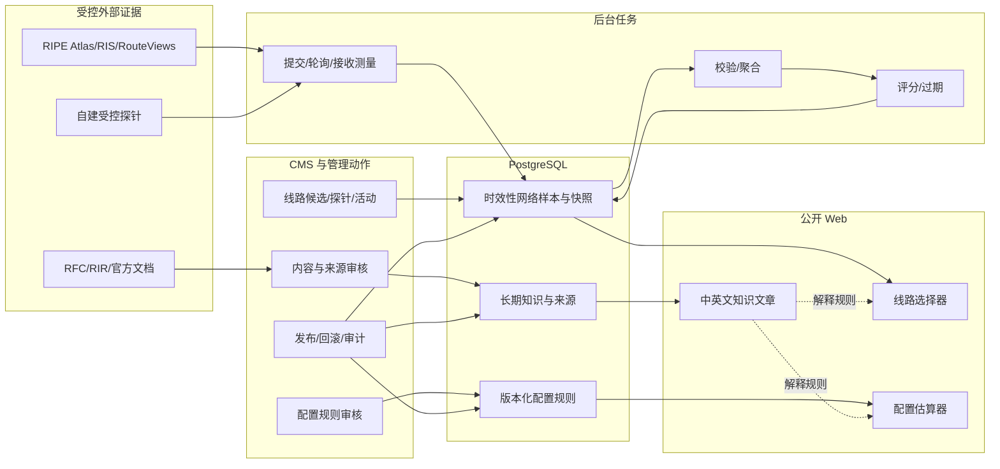

# 服务器知识库决策平台完整实施方案

- 状态：最终版，作为后续实施与验收基线
- 日期：2026-08-02
- 仓库基线：`0311192`
- 适用范围：知识内容 V3、来源治理、运营商线路评估、服务器配置估算、CMS、后台任务、双语公开页面、AI、SEO、缓存、发布与回滚
- 前置规格：[服务器知识库中英双语实施规格](./server-knowledge-base-bilingual-spec.md)

> 本文延续现有双语知识库，不替代已经落地的语言、翻译版本、卡片、发布和 AI 授权规则。发生冲突时，双语内容生命周期以原规格为准；新增的决策能力、实测数据和配置规则以本文为准。

## 1. 最终结论

知识库下一阶段不再以“增加更多概念文章”为核心，而是升级为一个可追溯的服务器决策平台。最终采用三个相互隔离的领域：

1. **长期知识内容**：继续使用现有 `knowledge_articles`，解释原理、输入条件、判断方法、验证步骤、风险和失效边界。
2. **时效性线路实测**：独立保存候选线路、探针、目标、活动、样本、聚合和评估快照；结果必须标注地区、运营商、接入类型、方向、协议、时间窗、证据等级和有效期。
3. **版本化配置规则**：独立保存服务器估算参数和来源，公式放在纯 TypeScript 引擎中；输出资源范围、计算轨迹、置信度、扩容触发器和验证清单。

公开产品增加两个双语工具：

```text
/tools/network-lines
/en/tools/network-lines
/tools/server-sizing
/en/tools/server-sizing
```

文章与工具通过模块关系连接：`KB-006/007/009/011/013/014/015` 可挂接线路选择器，`KB-002/030` 可挂接配置估算器。知识卡片继续展示稳定摘要，不展示实时分数、价格或短期结论。

以下边界冻结，不得在实施中自行改变：

- 中文源稿是双语事实源，英文译文不得新增独立事实。
- 商家标签、宣传名称或 ASN 本身不能证明线路质量。
- 缺少必要实测时返回“数据不足”，不能用零分、默认值或营销标签伪造推荐。
- 技术质量评分不混入价格；V1 不采集、展示或比较价格。
- 服务器估算缺少压测或生产遥测时只返回范围，不伪造精确配置。
- 动态线路结果和匿名估算输入不得自动写回知识正文，也不得直接进入长期 AI 引用。
- 公共用户不能提交任意 IP、URL、命令或探针 ID 触发 `ping`、`mtr`、`traceroute`。
- CMS 只能编辑有边界的参数和状态，不允许编辑 JavaScript、SQL 或任意表达式。
- 内容 V3、配置估算器和线路评估分别发布，不能打包成一次生产变更。

## 2. 当前基线与问题

### 2.1 已经具备的能力

当前仓库已经完成：

- 30 个双语知识单元，共 60 篇中文源稿与英文译稿。
- 中文 `/knowledge` 与英文 `/en/knowledge` 列表、搜索、详情、相关推荐、SEO 和 sitemap。
- `definition`、`highlights`、`quickTip` 三句式卡片和安全渲染。
- 中文源稿、英文译稿、`contentRevision`、`translatedFromRevision` 和同步发布门槛。
- 发布、取消发布、AI 授权、乐观锁、事务和防覆盖校验。
- 已发布且明确授权的分语言 AI 知识检索。
- `knowledge.changed` 缓存事件和知识内容校验脚本。
- 可复用的 `admin_background_jobs`、后台 worker、失败重试和任务接管机制。

现有关键边界位于：

```text
packages/db/schema.ts
src/server/knowledge/service.ts
src/features/cms/actions/knowledge.ts
src/features/cms/components/knowledge-manager.tsx
src/features/public/data/knowledge.ts
src/features/public/components/knowledge-card.tsx
packages/ai/knowledge-retrieval.ts
packages/cache/tags.ts
scripts/knowledge/initial-bilingual-content.ts
scripts/publish-initial-bilingual-knowledge.ts
```

### 2.2 内容缺口

现有文章已经有正确的结构和风险意识，但仍偏“解释型”：

- 22/30 个知识单元没有命令或可执行检查。
- 核心选型文章缺少从用户输入到决策输出的公式、阈值和完整案例。
- `KB-006/007/011/013/014/015` 主要停留在“购买前请实测”，没有统一的采样协议、证据等级和可比较结果。
- `KB-002/030` 没有将 RPS、响应时间、数据量、增长、RPO/RTO 映射到资源和拓扑。
- 当前来源几乎都按官方资料处理，没有真正带地区、运营商、方向、时段和原始样本的可复现实测证据。
- 部分来源需要更新；旧的中国电信产品 URL 已失效，联通线路文章缺少官方一手资料。

因此，下一步不是扩大文章数量，而是让现有 30 个单元具备可执行判断，并用工具承接动态计算。

## 3. 目标、非目标与成功指标

### 3.1 产品目标

用户完成一次决策后，应明确得到：

- **线路场景**：自己的地区、运营商和接入类型下，哪些候选有足够证据，电信/联通/移动分项如何，数据有多新，购买后还要测什么。
- **配置场景**：当前工作负载的起步、推荐和高可用三档资源，计算依据、瓶颈、置信度、何时扩容以及如何验证。
- **知识场景**：理解判断依据、适用边界、反例、命令、恢复路径和来源，而不是只记住产品名或口号。

### 3.2 工程目标

- 保持现有双语、SEO、缓存和 AI 行为向后兼容。
- 所有动态结论可追溯到不可变快照、算法版本、规则校验和与证据时间窗。
- 所有 CMS 写入通过管理员会话、领域服务、事务、乐观版本和审计日志。
- 公共 Web 保持只读；采集、聚合、评分和发布只在 CMS/后台任务侧运行。
- 公式和评分逻辑可在无数据库、无 Next.js 的环境中做确定性单元测试。
- 到期、缺失、冲突和不支持状态明确，不以旧数据或默认值静默降级。

### 3.3 内容成功指标

- 30 个中文源稿和 30 个英文译稿全部升级到 V3，ID、slug、分类和配对关系不变。
- 每篇 V3 至少包含：输入条件、判断规则、场景矩阵或步骤、推荐与不推荐边界、验证方法、失效条件、来源与复核日期。
- `KB-002/006/007/009/011/030` 首批 6 个单元具备完整决策输出。
- 时间变化内容不写成无日期的长青事实；线路文章不再使用“某线路一定最好”等绝对表达。
- 代表查询“电信线路”“移动回程”“联通跨境”“项目规模”“RPS”“RPO/RTO”能命中新内容。

### 3.4 工具成功指标

- 线路推荐只在满足证据和覆盖门槛时出现；E0/E1 或缺少必需单元格时显示“数据不足”。
- 线路结果同时展示 `qualityScore`、`confidence`、`evidenceGrade`、时间窗和有效期。
- 配置估算对同一输入、同一引擎和同一规则版本得到完全一致的输出与计算轨迹。
- 增加 RPS、数据量或增长不能降低资源建议；收紧 RPO/RTO 不能降低可靠性拓扑。
- 公开估算 V1 在浏览器内完成，不保存用户的 RPS、数据规模或 RPO/RTO。
- 中英文工具只本地化标签和解释，不复制两套算法或结构化事实。

### 3.5 非目标

- 不做云厂商或商家的实时比价、库存推荐和购买排序。
- 不保证某个线路、IP、CPU 型号或共享带宽在未来持续达到历史结果。
- 不从浏览器 IP 自动推断并保存用户所在地或运营商；V1 由用户明确选择。
- 不建设任意公网目标的测速平台、Looking Glass 或远程命令执行器。
- 不让 AI 自动发布文章、评估快照或规则集。
- 不用通用估算器覆盖 GPU/AI 训练、实时音视频、高频交易、主动多地域等专项架构。
- 不在 V1 保存公共用户的估算历史、线路偏好或精确业务规模。
- 不在本方案任务中执行生产迁移、生产内容写入、部署、提交或推送。

## 4. 用户输入与决策输出

### 4.1 线路选择器

V1 输入：

| 维度       | 值                                       | 说明                                                          |
| ---------- | ---------------------------------------- | ------------------------------------------------------------- |
| 用户地区   | 省份或预定义区域                         | 省份映射到华北、华东、华南、华中、西南、西北、东北等评分区域  |
| 运营商权重 | 电信优先、联通优先、移动优先、自定义权重 | 预设映射为权重；自定义权重总和必须为 `10000` 基点             |
| 接入类型   | 家庭宽带、企业宽带、移动网络、未知       | 未知只匹配不要求接入类型的聚合                                |
| 目标地区   | 香港、日本、新加坡、美国西部等受控枚举   | 不接受任意 IP 或 URL                                          |
| 业务类型   | Web/API、实时交互、下载、后台任务        | 决定指标权重，不改变原始数据                                  |
| 地址族     | IPv4                                     | 首发矩阵只开放 IPv4；IPv6/双栈完成独立矩阵后进入新 API schema |
| 平衡模式   | 加权或三网均衡                           | 加权按运营商权重组合；三网均衡使用最弱运营商优先规则          |

V1 输出：

- 推荐状态为 `recommended | candidate | insufficient`；新鲜度另为 `fresh | aging | expired`，两者不能混成一个状态。
- 候选线路、目标区域和实际测试前缀说明。
- 电信、联通、移动分项质量分和覆盖情况。
- 总体质量分、置信度、证据等级、观测时间窗、有效期和评分版本。
- 主要优势、风险、数据缺口和购买后验收清单。
- 不展示“最优”结论，除非当前输入范围内有满足门槛且证据充分的可比较候选。

### 4.2 服务器配置估算器

V1 输入分为六组：

1. 工作负载：静态站点、CMS/CRUD、API/SaaS、交易电商、批处理或自定义。
2. 流量：平均/峰值 RPS、动态比例、边缘缓存命中率、突发系数、响应时间、响应体大小和长连接数。
3. 实测：CPU 每请求耗时、峰值 RSS、每在途请求内存、压测断点和测试环境。
4. 数据：在线数据量、月增长、规划周期、数据库类型、连接数和 Redis 峰值。
5. 可靠性：可用性目标、RPO、RTO、故障备用实例和备份要求。
6. 运维能力：是否允许托管服务、团队能力和部署限制。

输出固定为：

- `start`：开发、试运行或非关键业务的最低可行范围。
- `recommended`：保留增长和运行余量的生产建议。
- `ha`：满足已声明可靠性目标的拓扑；证据不足时只给验证前提，不承诺目标。
- 标准化输入、资源范围、计算轨迹和稳定 `formulaId`。
- CPU、内存、存储、网络、数据库连接和副本数中的主要瓶颈。
- 假设、警告、缺失证据、不支持原因、扩容触发器和验证/恢复演练清单。
- `baseline`、`calibrated`、`validated` 三档置信度及各维度证据。

### 4.3 文章与工具的关系

- 文章负责回答“为什么、如何判断、如何验证、什么情况下失效”。
- 工具负责把当前输入映射到结构化结果。
- 工具结果必须链接到解释其关键规则的文章。
- 文章可以挂接工具，但不得复制工具的当前评分或计算结果为静态正文。
- 卡片只保留稳定的定义、2-3 个要点和一条速查，不承载实时状态。

## 5. 总体架构



### 5.1 分层边界

| 层                    | 责任                                      | 禁止事项                                  |
| --------------------- | ----------------------------------------- | ----------------------------------------- |
| `packages/core`       | 输入校验、纯计算、评分、reason code、版本 | 导入数据库、Next.js、React 或读取环境变量 |
| `packages/db`         | schema、关系、约束、索引                  | 承担业务评分或 UI 本地化                  |
| `src/server`          | 事务、读取、任务、发布、失效和审计        | 将不可信公共输入传给系统命令              |
| `src/features/cms`    | 管理表单、预览、审批和可读错误            | 绕过管理员鉴权或直接拼写 SQL              |
| `src/features/public` | 只读加载、工具 UI、本地化和 SEO           | 写入测量、规则或知识内容                  |
| 后台 worker           | 外部 API、探针接收、聚合、评分和保留策略  | 在公共请求生命周期内运行长任务            |

### 5.2 三种版本空间

三个领域的版本不能混用：

- 知识内容：`contentRevision` 与 `translatedFromRevision`。
- 线路评估：`formulaVersion`、不可变候选/目标/活动 revision、策略校验和与快照 ID。
- 配置估算：`ENGINE_VERSION`、`schemaVersion`、`ruleSetVersion` 与规则校验和。

任何公开结果必须携带自己领域的版本，不得只展示应用 commit 或 `updatedAt`。

## 6. 来源与证据治理

### 6.1 来源权威等级

`sourceAuthority` 与线路证据等级、估算置信度是三个不同概念：

| 等级 | 可接受来源                                            | 用途                               |
| ---- | ----------------------------------------------------- | ---------------------------------- |
| A    | RFC、IANA、RIR/RDAP、官方产品与软件文档、官方架构指南 | 协议事实、产品定义、命令和配置边界 |
| B    | 带完整元数据、可重放方法和时间窗的实测或生产观测      | 时延、丢包、路径、吞吐和容量结论   |
| C    | 商家宣传、论坛、博客、测评文章                        | 发现线索和交叉核对，不单独支撑推荐 |

规则：

- 来源等级按具体主张判断，不按网站整体永久授级。
- A 级产品文档可证明“官方如何定义产品”，不能证明当前某个售卖实例达到宣传质量。
- B 级必须保存采样条件；截图、单次测速或无原始上下文的图表不算 B 级。
- C 级内容不得成为 AI 事实链中的唯一依据。
- URL、发布日期、访问日期、支持的主张和下次复核日期必须可查询。

### 6.2 结构化来源表

新增 `knowledge_sources`，只保存稳定身份和当前 revision 指针：

```text
id, sourceKey, kind, authorityTier, currentRevisionId,
reviewDueAt, validUntil, status, notes, createdAt, updatedAt
```

新增不可变 `knowledge_source_revisions`：

```text
id, sourceId, revision, publisher, title, canonicalUrl,
publishedAt, retrievedAt, contentHash, changeReason,
createdBy, createdAt
```

新增 `knowledge_article_sources`，引用具体来源 revision：

```text
articleId, sourceRevisionId, citationKey, claimScope,
sortOrder, createdAt
```

关键约束：

- `sourceKey` 全局唯一且稳定；URL 变更不改变 key。
- `(sourceId, revision)` 唯一；已被引用的 revision 不可编辑。
- 标题、URL、发布者、内容 hash 或检索时间变化时创建新 revision，再原子更新 `currentRevisionId`；服务端验证该 revision 属于同一来源，不得改写历史 revision。
- `(articleId, citationKey)` 唯一。
- 中英文配对发布前，使用的 `citationKey` 集合必须一致；英文 `claimScope` 只翻译中文主张。
- 文章详情按本语言渲染结构化来源列表：原始标题、发布者、canonical URL、发布日期/访问日期和该来源支持的主张。
- `knowledge_article_sources` 属于内容事实集；增删、换 revision 或修改公开 claim scope 必须进入现有内容 revision、译文同步和 AI 撤权流程。
- 来源产生新 revision 后，历史文章仍指向旧 revision；编辑必须显式复核并升级文章引用，不能由 `currentRevisionId` 静默改变已发布文章。
- `status` 为 `active | superseded | broken | retired`。
- `broken` 或已过 `validUntil` 的关键来源阻止重新发布，不自动下线当前页面，但创建 CMS 告警。
- revision 的 `contentHash` 用于发现文档内容变化，不代表已经完成事实复核。

### 6.3 首批来源目录

网络与路由：

- [RFC 4271: BGP-4](https://www.rfc-editor.org/info/rfc4271/)
- [APNIC RDAP](https://www.apnic.net/about-apnic/whois_search/about/rdap/)
- [RouteViews](https://www.routeviews.org/routeviews/)
- [RIPE RIS](https://ris.ripe.net/)
- [RIPE Atlas](https://atlas.ripe.net/docs/getting-started/)
- [PeeringDB Documentation](https://docs.peeringdb.com/)
- [China Telecom Global Internet Access](https://www.chinatelecomglobal.com/expertises/productservices/2457/2496)
- [China Telecom Global Transit](https://www.chinatelecomglobal.com/expertises/productservices/2457/2497)
- [China Mobile International Internet Services](https://www.cmi.chinamobile.com/en/solutions/internet-services/)
- [China Unicom Global IP Transit and Peering](https://eu.chinaunicomglobal.com/products-ipt-and-peering)

V3 必须将当前 `ctgTransit` 的旧 URL `https://www.chinatelecomglobal.com/products/Internet-Access/IP-Transit` 替换为上面的 Global Internet Access 与 Global Transit 两条独立来源，并分别收窄 claim；旧 URL 当前返回 404，不能只改 label 后继续保留。

容量与可靠性：

- [AWS Well-Architected Performance Efficiency](https://docs.aws.amazon.com/wellarchitected/latest/performance-efficiency-pillar/welcome.html)
- [Google Cloud Performance Optimization](https://docs.cloud.google.com/architecture/framework/performance-optimization)
- [Google SRE: Handling Overload](https://sre.google/sre-book/handling-overload/)
- [PostgreSQL Resource Consumption](https://www.postgresql.org/docs/current/runtime-config-resource.html)
- [Kubernetes Resource Management](https://kubernetes.io/docs/concepts/configuration/manage-resources-containers/)
- [k6 Load Testing](https://grafana.com/docs/k6/latest/testing-guides/load-testing-websites/)

内容团队还应按文章补充 NGINX、OpenSSH、Docker、Let's Encrypt、Linux 发行版、systemd、IANA 和安全机构的一手文档。任何运营商的具体产品标签都在首批发布前单独核验；未找到当前有效的官方定义时，只能用控制面和实测描述，不得引用未经核验的产品营销页。

### 6.4 可借鉴的知识库及方法

| 参考库                                                                                                                                                                     | 借鉴内容                                        | 不能照搬的部分                            |
| -------------------------------------------------------------------------------------------------------------------------------------------------------------------------- | ----------------------------------------------- | ----------------------------------------- |
| [AWS Well-Architected](https://docs.aws.amazon.com/wellarchitected/latest/framework/welcome.html)                                                                          | 按工作负载提问、权衡、风险和改进项组织决策      | AWS 产品绑定和 SKU 结论                   |
| [Google Cloud Architecture Framework](https://docs.cloud.google.com/architecture/framework)                                                                                | 目标、原则、评估问题和验证闭环                  | GCP 独有服务映射                          |
| [Google SRE Book](https://sre.google/sre-book/table-of-contents/)                                                                                                          | SLO、容量、过载、监控和恢复演练                 | 将大型组织流程原样套到小团队              |
| [RIPE Atlas Documentation](https://atlas.ripe.net/docs/)                                                                                                                   | 探针、测量、结果元数据和可复现方法              | 把 Atlas 单向样本直接当产品质量保证       |
| [Cloudflare Learning Center](https://www.cloudflare.com/learning/)                                                                                                         | 分层解释 DNS、BGP、TLS、DDoS 等网络概念         | Cloudflare 产品营销或未交叉核验的效果主张 |
| [DigitalOcean Community Tutorials](https://www.digitalocean.com/community/tutorials)                                                                                       | 面向任务的步骤、先决条件、验证与回滚写法        | 未核对版本的命令、第三方作者观点          |
| [Akamai/Linode Docs](https://www.linode.com/docs/)                                                                                                                         | VPS 初始化、网络、备份和故障排查的 runbook 结构 | 平台专属控制台步骤和商业默认值            |
| [Ubuntu Server Documentation](https://documentation.ubuntu.com/server/) 与 [Red Hat Docs](https://docs.redhat.com/)                                                        | 发行版相关命令、安全和生命周期边界              | 跨发行版直接复制命令                      |
| [NGINX Documentation](https://nginx.org/en/docs/)、[PostgreSQL Documentation](https://www.postgresql.org/docs/) 与 [Kubernetes Documentation](https://kubernetes.io/docs/) | 版本化配置、参数语义、验证命令和官方警告        | 将示例配置当作通用生产参数                |

借鉴规则：

- 借鉴信息架构和验证方法，不复制文案；每个事实回到可引用的一手来源。
- 商业厂商知识库中与其产品无关的协议解释仍需 RFC/RIR/软件官方文档交叉核对。
- 社区教程用于发现操作步骤，正式发布前在当前支持版本上实测，并记录命令输出与回滚。
- 不使用假定 CPU 性能、共享带宽或缓存命中率的不透明在线 SKU 计算器作为规则来源。
- 检查来源许可；引用短句和事实并链接原文，不批量搬运受版权保护的教程正文或图表。

## 7. 知识内容 V3

### 7.1 内容模板

现有 `summary` 继续服务 SEO、详情摘要和 AI；卡片继续使用 `definition/highlights/quickTip`。正文统一为：

1. **结论与适用范围**：一句可验证结论，明确不适用场景。
2. **需要收集的输入**：用户地区、运营商、RPS、数据量等，不先猜答案。
3. **判断规则**：公式、阈值、决策树或步骤，并标明规则版本或来源。
4. **场景矩阵**：至少包含适合、不适合、风险和替代方案。
5. **推荐输出**：给出条件化建议，不写绝对“最好”。
6. **验证方法**：命令、指标、时间窗、成功标准和如何保存证据。
7. **升级/失效条件**：何时复测、扩容、回滚或转专项设计。
8. **来源与复核**：来源主张、核验日期和下次复核日期。

卡片文案只取稳定结论。例如线路卡片可写“需要按地区、运营商和双向晚高峰实测”，不能写“香港某线路当前延迟最低”。

### 7.2 首批 6 个决策单元

| ID     | 必须补齐的内容                                                                       | 对应模块         |
| ------ | ------------------------------------------------------------------------------------ | ---------------- |
| KB-002 | 原站 RPS、CPU demand、并发、内存、存储和网络公式；缺少实测时的范围输出；三个完整案例 | 配置估算器       |
| KB-006 | AS4134、AS4809、CN2、GIA、GT 的关系与边界；去回程验证；不得用 ASN 直接证明产品       | 线路选择器       |
| KB-007 | 移动、联通候选线路、控制面线索、双向实测和地区差异；补联通官方来源                   | 线路选择器       |
| KB-009 | 统一七天测量协议、晚高峰、双向、IPv4/IPv6、样本质量和证据保存                        | 测量方法说明     |
| KB-011 | 地区 × 电信/联通/移动 × 目标机房 × 业务类型矩阵；质量与置信度分开                    | 线路选择器主入口 |
| KB-030 | 项目类型、规模、RPO/RTO、团队能力到单机/双机/托管/高可用拓扑                         | 配置估算器       |

完成后再升级 `KB-003`、`KB-012`、`KB-029`；地区类文章复用同一决策模型，不各自发明一套线路规则。

### 7.3 30 个单元的发布波次

| 波次       | 单元                                           | 记录数 | 目标                                     |
| ---------- | ---------------------------------------------- | -----: | ---------------------------------------- |
| A 决策试点 | KB-002、006、007、009、011、030                |     12 | 两个核心决策闭环                         |
| B 扩展决策 | KB-001、003、005、010、012、013、014、015、029 |     18 | 产品、指标、地区和监控                   |
| C 基础概念 | KB-004、008、016、017、019、027                |     12 | 虚拟化、专线、IP、DNS 和 DDoS            |
| D 操作排障 | KB-018、020-026、028                           |     18 | 查询、初始化、部署、安全、备份和故障恢复 |

波次 A 必须人工逐篇审核。波次 B-D 可以使用固定模板辅助，但每个双语对仍需事实、命令、来源和翻译审核。

### 7.4 V3 发布不是 schema migration

当前 `knowledge_articles` 已能承载正文、卡片、双语版本、SEO 和 AI 状态。V3 文案升级不新增数据库字段，也不复用现有 `revise-v2`：

- 先冻结 60 条完整 V2 渲染快照和 SHA-256 清单，再编写 V3/cards-v2。
- 新建 V2→V3 专用发布器；旧发布器只识别 V1/V2 和 cards V0/V1，必须保持不变供历史审计。
- 每个中英双语对在一个事务中锁定并更新，不能通过多次独立动作临时形成半更新状态。
- 事务内二次核对旧哈希、`contentRevision`、语言、分类和翻译关系。
- ID、slug、分类、翻译源、`published`、`publishedAt` 保持不变；两边 revision 单调递增。
- 英文 `translatedFromRevision` 指向更新后的中文 revision。
- 更新开始先关闭该对 AI 引用；页面、SEO、缓存和同步验证通过后再显式开启。

生产差异只允许：

| 状态              | 处理                                   |
| ----------------- | -------------------------------------- |
| `EXACT_V2`        | 允许升级                               |
| `EXACT_V3`        | 幂等跳过                               |
| `MANUAL_DIVERGED` | 整波停止，输出字段差异，人工吸收或排除 |
| `MISSING`         | 停止，不自动补建                       |
| `PAIR_BROKEN`     | 停止，单独修复关系                     |
| `STATE_BLOCKED`   | 停止，修复发布、AI 或版本状态          |
| `SCHEMA_DRIFT`    | 停止，先修复迁移基线                   |

额外的非受管知识条目不参与 V3 更新，也不得被发布器删除或改写。

### 7.5 内容版本历史

V3 发布先使用仓库快照完成可审计回滚。后续平台迁移新增 `knowledge_article_versions`：

```text
id, articleId, contentRevision, documentJson,
sourceSetJson, sourceSetHash, reason, createdBy, createdAt
```

- `(articleId, contentRevision)` 唯一。
- `documentJson` 保存所有影响翻译或公开渲染的字段，不保存会话或秘密。
- `sourceSetJson` 保存当时的 citation key、不可变 source revision ID 和 claim scope，使历史版本可完整重建；`sourceSetHash` 用于快速校验。
- 恢复历史内容时创建新的 `contentRevision`，不能倒退版本号。
- 中文恢复后，英文仍按现有规则进入待同步并关闭 AI，除非使用经过审核的双语对原子恢复。

### 7.6 30 个单元逐项改造矩阵

| ID     | V3 核心补充                                     | 必须产出的决策资产                    |
| ------ | ----------------------------------------------- | ------------------------------------- |
| KB-001 | VPS、云服务器、独立服务器的隔离、弹性和运维边界 | 选择矩阵、反例、升级条件              |
| KB-002 | CPU、内存、存储、网络从负载输入推导             | 公式、三个案例、配置估算器            |
| KB-003 | 带宽、流量、并发与响应体大小                    | Mbps/流量公式、突发与 95 计费边界     |
| KB-004 | KVM、OpenVZ/LXC、VMware 的隔离与超售风险        | 能力矩阵、宿主争用验证                |
| KB-005 | HDD、SSD、NVMe 的延迟、IOPS、耐久和数据安全     | 工作负载矩阵、fio 安全测试边界        |
| KB-006 | 电信 AS4134/AS4809、CN2、GIA、GT                | 名词边界、去回程验证、线路模块        |
| KB-007 | 联通、移动国际路径和地区差异                    | 官方来源、控制面线索、双向实测        |
| KB-008 | IPLC、IEPL、专线与公共互联网                    | 合同/SLA 核对表、隔离边界             |
| KB-009 | ping、MTR、traceroute 与统一测试协议            | 七天协议、样本模板、质量标记          |
| KB-010 | BGP、前缀、AS_PATH 和去回程不对称               | 路径判断流程、RouteViews/RIS 示例     |
| KB-011 | 地区、运营商、目标机房和业务类型                | 三网矩阵、评分解释、线路选择器        |
| KB-012 | RTT、丢包、抖动、TCP/TLS/TTFB                   | 指标解释、分位数、业务 SLO 映射       |
| KB-013 | 香港机房、带宽、合规与大陆访问                  | 条件矩阵、实测入口、失效日期          |
| KB-014 | 日本与新加坡面向大陆/东南亚                     | 用户分布矩阵、多地域验证              |
| KB-015 | 美国西部/东部与全球访问                         | 距离/路径矩阵、CDN 与源站边界         |
| KB-016 | IPv4、IPv6 和双栈                               | 能力矩阵、DNS/监听/防火墙验证         |
| KB-017 | 原生、广播、住宅 IP 市场标签                    | RDAP/ASN/路由核验、风控非保证声明     |
| KB-018 | ASN、RIR、RDAP 与网络归属                       | 结构化查询步骤、注册与路由差异        |
| KB-019 | A、AAAA、CNAME、TTL 和 DNS 发布                 | 记录矩阵、dig 验证、回滚计划          |
| KB-020 | IP 被封、端口不通、DNS 失败                     | 分层排障树、证据采集、升级路径        |
| KB-021 | 新 VPS Linux 初始化                             | 可勾选清单、验证命令、锁定前回退      |
| KB-022 | SSH 密钥、密码切换和失联风险                    | 双会话切换流程、sshd 校验、恢复通道   |
| KB-023 | Docker Compose 生产部署                         | 配置结构、健康检查、日志/备份/回滚    |
| KB-024 | Nginx 反向代理、TLS 与续期                      | 安全配置、`nginx -t`、证书续期演练    |
| KB-025 | 数据库、文件和异地备份                          | RPO/RTO 矩阵、3-2-1、恢复演练         |
| KB-026 | 防火墙、最小权限和补丁                          | 分阶段加固、验证、避免锁死            |
| KB-027 | DDoS 清洗、高防和业务可用性                     | 威胁/容量矩阵、供应商问题清单         |
| KB-028 | 502、504、connection refused                    | 从客户端到上游的排障树和恢复步骤      |
| KB-029 | CPU、内存、磁盘、证书与可用性告警               | 指标/阈值来源、告警分级、runbook 链接 |
| KB-030 | 个人站、企业站、电商、API 的规模和可靠性        | 输入到拓扑矩阵、三个案例、配置估算器  |

“必须产出的决策资产”是发布门槛，不要求每篇都强行加入 shell 命令；协议或产品定义类文章可以使用结构化查询、合同核对或工具输出完成验证。

## 8. 运营商线路评估系统

### 8.1 领域模型

新增以下表，所有名称为建议的最终命名；实施时必须通过 Drizzle schema 和生成迁移落地，不使用生产 `db:push`。

| 表                                       | 核心字段                                                                                                                                                                                                                                                                                                        | 责任                                            |
| ---------------------------------------- | --------------------------------------------------------------------------------------------------------------------------------------------------------------------------------------------------------------------------------------------------------------------------------------------------------------- | ----------------------------------------------- |
| `knowledge_article_modules`              | `sourceArticleId`, `moduleType`, `config`, `enabled`, `sortOrder`                                                                                                                                                                                                                                               | 给双语知识单元挂接同一个工具模块                |
| `network_line_candidates`                | `slug`, `name`, `enName`, `providerId`, `currentConfigurationRevisionId`, `status`, `archivedAt`                                                                                                                                                                                                                | 保存候选稳定身份和当前配置指针                  |
| `network_line_candidate_revisions`       | `candidateId`, `revision`, `regionCode`, `datacenter`, `productRef`, `declaredLabels`, `configurationJson`, `configurationHash`, `createdBy`, `createdAt`                                                                                                                                                       | 不可变保存实际线路/产品配置                     |
| `network_target_agents`                  | `candidateId`, `externalId`, `currentConfigurationRevisionId`, `status`, `lastSeenAt`                                                                                                                                                                                                                           | 保存受控目标侧 agent 的稳定身份                 |
| `network_target_agent_revisions`         | `targetAgentId`, `revision`, `capabilities`, `configurationHash`, `createdAt`                                                                                                                                                                                                                                   | 不可变保存 agent 能力和配置                     |
| `network_measurement_targets`            | `candidateId`, `currentConfigurationRevisionId`, `enabled`                                                                                                                                                                                                                                                      | 保存测试目标稳定身份和当前配置指针              |
| `network_measurement_target_revisions`   | `targetId`, `revision`, `targetAgentRevisionId`, `addressFamily`, `targetAddress`, `targetPrefix`, `originAsn`, `port`, `configurationHash`, `createdAt`                                                                                                                                                        | 不可变保存受控测试终点配置                      |
| `network_target_prefix_verifications`    | `targetRevisionId`, `deliveryPrefixHash`, `verificationMethod`, `evidenceRef`, `verifiedBy`, `verifiedAt`, `validUntil`, `invalidatedAt`                                                                                                                                                                        | 审计测试目标与实际交付前缀的同前缀核验          |
| `network_measurement_probes`             | `sourceKind`, `externalId`, `currentConfigurationRevisionId`, `status`, `lastSeenAt`                                                                                                                                                                                                                            | 保存 RIPE、自建或合作探针稳定身份               |
| `network_measurement_probe_revisions`    | `probeId`, `revision`, `countryCode`, `regionCode`, `carrier`, `accessType`, `asn`, `capabilities`, `trustLevel`, `ownerOrgKey`, `accessPrefixKey`, `physicalSiteKey`, `independenceKey`, `configurationHash`, `createdAt`                                                                                      | 不可变保存探针位置、接入属性和独立性证据        |
| `network_measurement_credentials`        | `probeId`, `targetAgentId`, `keyId`, `secretCiphertext`, `activatedAt`, `expiresAt`, `revokedAt`, `rotationOfId`                                                                                                                                                                                                | 通过二选一 FK 保存每探针/agent 的可轮换签名凭据 |
| `network_measurement_ingest_nonces`      | `credentialId`, `nonce`, `requestTimestamp`, `expiresAt`                                                                                                                                                                                                                                                        | 持久化防重放 nonce                              |
| `network_measurement_campaigns`          | `candidateId`, `status`, `currentConfigurationRevisionId`, `runGeneration`, `nextRunAt`                                                                                                                                                                                                                         | 保存测量活动身份、调度状态和当前配置指针        |
| `network_measurement_campaign_revisions` | `campaignId`, `revision`, `probeSelector`, `metricProfile`, `protocolVersion`, `intervalMinutes`, `peakWindows`, `startsAt`, `endsAt`, `configurationJson`, `configurationHash`, `createdAt`                                                                                                                    | 不可变保存七天或持续测量活动配置                |
| `network_measurement_runs`               | `campaignId`, `campaignRevisionId`, `slotAt`, `status`, `externalMeasurementId`, `runGeneration`, `attempts`, `coverageBps`, `errorDetail`, `startedAt`, `finishedAt`                                                                                                                                           | 记录一次可重试、可接管的采集执行                |
| `network_measurement_raw_batches`        | `runId`, `sourceKind`, `credentialId`, `batchId`, `bodyHash`, `payload`, `receivedAt`, `expiresAt`                                                                                                                                                                                                              | 与规范化样本分开保存短期原始 payload            |
| `network_measurement_samples`            | `runId`, `rawBatchId`, `probeRevisionId`, `targetRevisionId`, `direction`, `protocol`, `observedAt`, 指标字段, `pathHash`, `qualityFlags`, `parserVersion`                                                                                                                                                      | 保存规范化数据面样本及采样时配置                |
| `network_route_observations`             | `targetRevisionId`, `collector`, `vantageKey`, `prefix`, `originAsn`, `asPath`, `eventType`, `observedAt`, `pathHash`, `parserVersion`                                                                                                                                                                          | 保存 RIS/RouteViews 等控制面观察                |
| `network_measurement_rollups`            | candidate/target/probe/campaign revision manifest、窗口、地区、运营商、接入类型、方向、协议、样本数、探针数、分布 sketch、分位指标、`rollupSchemaVersion`, `inputHash`                                                                                                                                          | 保存可合并的小时、日和活动级聚合                |
| `network_route_state_snapshots`          | `candidateRevisionId`, `addressFamily`, `targetSetHash`, `routeStatePolicyVersion`, `materialRouteStateHash`, `inputManifestJson`, `inputManifestHash`, `observedFrom`, `observedTo`, `createdAt`                                                                                                               | 不可变保存经 quorum 确认的物质路由状态          |
| `network_route_state_inputs`             | `routeStateSnapshotId`, `routeObservationId`, `evidenceRole`                                                                                                                                                                                                                                                    | 将物质路由状态绑定到实际控制面观察              |
| `network_route_state_heads`              | `candidateId`, `addressFamily`, `routeStateSnapshotId`, `headRevision`, `updatedAt`                                                                                                                                                                                                                             | 指向每候选和地址族的当前物质路由状态            |
| `network_assessment_snapshots`           | `candidateId`, `audienceProfileKey`, `candidateRevisionId`, `targetSetHash`, `routeStateSnapshotId`, `measurementProtocolVersion`, `parserVersion`, `rollupSchemaVersion`, `formulaVersion`, `policyChecksum`, `inputManifestJson`, `inputManifestHash`, 时间窗, `validUntil`, 三家运营商分项评估和 reason code | 保存不可变且可重现的基准评分输入与分项结果      |
| `network_assessment_input_rollups`       | `snapshotId`, `rollupId`, `cellKey`, `role`, `weightBps`                                                                                                                                                                                                                                                        | 将快照绑定到长期保留的实际聚合输入              |
| `network_assessment_sources`             | `snapshotId`, `sourceRevisionId`, `claimScope`, `evidenceRole`                                                                                                                                                                                                                                                  | 绑定产品定义、SLA、合同或控制面来源 revision    |
| `network_assessment_heads`               | `candidateId`, `audienceProfileKey`, `snapshotId`, `headRevision`, `updatedBy`, `updatedAt`                                                                                                                                                                                                                     | 原子指向当前公开快照；撤销时允许 snapshot 为空  |
| `network_assessment_publication_events`  | `candidateId`, `audienceProfileKey`, `snapshotId`, `eventType`, `idempotencyKey`, `reason`, `actorId`, `createdAt`                                                                                                                                                                                              | 追加记录发布、撤销、回滚、过期观察和拒绝原因    |

文章模块约束：

- `sourceArticleId` 只指向中文源稿；英文页面通过 `translationSourceArticleId` 解析同一个模块。
- `moduleType` 首版只允许 `network_line_selector | server_sizing`。
- `(sourceArticleId, moduleType)` 唯一。
- `config` 只保存允许的默认枚举、相关 profile 和显示位置，不保存公式、实时分数或本地化正文。
- 模块在对应工具未发布或不可用时不渲染空容器，文章正文仍可独立阅读。

`audienceProfileKey` 只表示有限、可审核的基准维度：

```text
userScoreRegion / accessType / destinationRegion / workload / addressFamily
```

- 单个快照包含电信、联通、移动三个 `operatorAssessment`；每项分别保存 `qualityScoreBps`、`confidenceBps`、`evidenceGrade`、整体/晚高峰覆盖、缺失单元格和 reason code，不包含用户自定义权重或请求派生总分。
- 内部基准按 IPv4 或 IPv6 分开生成；公共 V1 只读取 IPv4。IPv6/双栈不得在 V1 临时拼分，需完成独立覆盖矩阵、跨地址族组合规则和 `schemaVersion: 2` 后开放。
- 公共 API 在内存中应用运营商权重和 balance mode，不为匿名请求创建 snapshot、head 或运行记录。
- 省份到 `userScoreRegion` 的映射属于版本化 policy；没有可靠映射或对应区域证据时返回 insufficient，不偷偷回退到全国平均。

建议的关键类型：

- ASN 使用 `bigint`，避免四字节 ASN 截断。
- IP 与前缀优先使用 PostgreSQL `inet/cidr`，应用层仍通过结构化 IP 解析器校验。
- 分数、覆盖率、权重和丢包率使用 `0..10000` 整数基点，不使用浮点持久化。
- RTT、抖动和握手耗时用整数微秒或毫秒并在字段名标明单位。
- 吞吐使用整数 `kbps` 或 `bps`，不能只写含糊的 `speed`。
- AS_PATH 使用 JSON 字符串数组；四字节 ASN 不转 JavaScript 普通整数。
- `declaredLabels` 只记录商家声称的标签，不参与技术质量评分。
- 原始 payload 限制大小并单独保存在 raw batch；sample 只保留 `rawBatchId` 和规范化字段，便于独立执行 30/90 天保留策略。

### 8.2 约束与索引

必须由数据库或领域服务保证：

- 候选 `slug` 唯一；归档不复用 slug。
- candidate、target agent、target、probe 和 campaign 的 `(parentId, revision)` 及 configuration hash 唯一；当前指针只能指向同一 parent 的 revision，已被 sample/run/rollup/snapshot 使用的 revision 不可修改或删除。
- 目标 revision 的 `(candidateId, addressFamily, targetAddress, port)` 在有效配置中唯一。
- 探针 `(sourceKind, externalId)` 唯一。
- 凭据的 `probeId/targetAgentId` 必须且只能填写一个，使用真实 FK；`keyId` 全局唯一。secret 使用现有服务端密钥封装机制加密，不以明文写库或日志。
- nonce `(credentialId, nonce)` 唯一并覆盖完整重放窗口。
- 运行 `(campaignId, slotAt, campaignRevisionId, runGeneration)` 唯一，保证调度幂等并隔离旧 generation。
- 自建 raw batch `(credentialId, batchId)`、外部 raw batch `(sourceKind, batchId)` 和 body hash 幂等；自建来源必须有 credential，受控外部 API 来源允许为空。
- 样本对其上游 run、probe revision 和 target revision 使用限制删除 FK；`rawBatchId` 允许为空并在 raw retention 时 `ON DELETE SET NULL`。
- 每个 `(candidateId, audienceProfileKey)` 只能有一个 head。
- 每个 `(candidateId, addressFamily)` 只能有一个 route state head；head 只能指向同一候选当前 revision 和地址族的 route state snapshot。
- 快照一经创建不可更新评分、公式、时间窗或证据；修正必须产生新快照。
- `network_assessment_heads.snapshotId` 必须属于相同候选和 audience profile，发布服务在事务内验证。
- route state snapshot 创建时验证当前不可变 candidate/target revision 和 route policy，绑定形成 quorum 的 observation；`targetSetHash` 对按稳定键排序的 target revision ID/configuration hash 计算，`materialRouteStateHash` 对按 collector/vantage/prefix 排序的 route input ID/path signature 计算。两者不能只保存无法反查输入的裸 hash。
- assessment snapshot 创建时验证不可变 candidate/target/agent/probe/campaign revision、当前有效前缀核验、当前 route state snapshot、协议、parser、rollup schema、policy 和全部 input rollup/source revision；`inputManifestJson` 记录相应 ID/hash，缺少任一引用时拒绝创建。
- assessment input rollup、route state/input 和 source revision 一经绑定不可替换；快照被 head 或 publication event 引用后限制删除。
- 前缀核验引用不可变 target revision；同一 target revision 只能有一个当前有效核验。candidate/target revision、交付前缀、origin ASN 或证据有效期变化后旧核验失效，未重新核验时证据等级最高为 E1。
- head 更新使用 `headRevision` 乐观条件；每次 publish/withdraw/rollback 同事务追加 publication event。
- publication event 的 `idempotencyKey` 唯一；expiry job、重试的管理动作和 workflow 重跑不会追加重复事件。
- 所有状态字段有检查约束；所有分数和覆盖率限制在 `0..10000`。
- candidate、target agent、target、probe、campaign 的 revision 与 `runGeneration` 从 1 开始，只递增。
- 常用索引覆盖：任务状态+时间、raw expiry、nonce expiry、样本目标+时间、rollup 维度+时间、快照候选+profile+创建时间、有效期和 publication event 时间。

初期不强制对样本表分区。规范化样本超过约一千万行或保留任务出现明显锁/扫描压力后，再通过单独迁移按月分区；不得提前把分区复杂性扩散到领域 API。

### 8.3 候选身份与产品标签

一个候选必须代表可重复购买、可定位测试的实际网络产品，而不是宽泛名称“CN2”或“优化线路”。发布前至少记录：

- 提供方、机房、目标地区、实际购买套餐或内部标识。
- 当前测试 IP 与前缀、origin ASN、地址族及其不可变 candidate/target revision。
- 商家宣称标签及来源，但明确标记为 `declared`。
- 测试目标与实际交付前缀的核验记录：脱敏交付前缀 hash、核验方法、受限 evidence ref、核验人、时间和有效期；不是一个可手工切换的布尔值。
- 路由、目标、机房、套餐或交付前缀实质变化时创建新的不可变配置 revision，并立即使旧公开快照过期；未完成当前 revision 的同前缀核验时证据等级不能高于 E1。

只测试商家提供的公共测速 IP 不能证明购买后的实际前缀。产品级推荐至少需要真实购买实例或已验证同前缀目标。

### 8.4 统一测量协议

首版协议命名为 `network-measurement-protocol-v1`，具体调度参数进入版本化配置快照。最低要求：

1. 连续覆盖 7 天，至少包含 5 个有效自然日，其中至少 1 个周末日。
2. 同时覆盖非高峰和中国当地时间晚高峰；高峰窗口初始定义为 `19:00-23:00 Asia/Shanghai`。
3. 基础 RTT/丢包/TCP 测量建议每 30 分钟一次；路由观察和受控吞吐测试使用更低频率，避免探针对线路造成不必要流量。
4. 每个必需的“地区 × 运营商 × 接入类型 × 方向 × 地址族”单元格至少有 2 个独立探针。两个探针必须具有不同 `independenceKey`，且不能同时来自同一宿主组织、物理站点和接入前缀范围；无法核验独立性时按一个探针计。
5. 每个独立探针在整体和晚高峰各达到至少 70% 调度覆盖；单元格在整体和晚高峰各达到至少 80%；有效日同时达到全天和峰时门槛。整体覆盖再高也不能弥补峰时完全缺失。
6. 正向由用户侧探针测目标，反向由绑定候选和实际前缀的目标侧 agent 测受控探针 reflector。缺目标 agent、反向 reflector 或认证链时只能展示单向证据，证据不能升级为 E2。
7. RTT 是往返时间：正向 RTT 与反向 RTT 是两个不同起点的往返观测；正向/反向 traceroute 分别描述路径。V1 不把它们称为单向时延；只有时钟同步和误差预算经过验证后才另行支持 one-way delay。
8. IPv4 与 IPv6 分开测量、分开评分；V1 只公开 IPv4。未来双栈必须两个地址族都完整，并在新版本中明确定义跨地址族质量、置信度、证据、新鲜度和排序组合规则。
9. 目标、target agent、探针、协议、包大小、端口、DNS 解析结果、开始/结束时间和采样频率全部进入活动配置哈希。
10. 吞吐测试必须限速、限时且使用专用数据；不得下载真实用户数据或绕过提供方使用条款。
11. 解析器保留无效样本的质量标记，不静默删除异常；聚合明确报告有效数、无效数和缺失数。

探针建设目标按“华北、华东、华南、华中、西南”五个区域推进，每区至少覆盖电信、联通、移动。若某个公开推荐只面向用户选择的单一区域，可以只要求该区域完整；“全国三网均衡”必须满足全部配置为必需的区域单元格。

#### 8.4.1 首发覆盖矩阵

首发范围固定为版本化 `network-launch-scope-v1`，避免表单先做全国全场景、数据却只覆盖一个测试点：

| 维度     | 首发必须覆盖                                              |
| -------- | --------------------------------------------------------- |
| 目标地区 | 香港                                                      |
| 用户区域 | 华北、华东、华南                                          |
| 运营商   | 中国电信、中国联通、中国移动家庭宽带                      |
| 接入类型 | `residential`                                             |
| 业务     | `web_api`                                                 |
| 地址族   | IPv4                                                      |
| 方向     | 探针→目标、目标 agent→探针 reflector                      |
| 候选数量 | 每个可推荐 audience profile 至少 2 个达到 E2 的可比较候选 |

- matrix 作为 network policy 的结构化部分发布，列出每个必需 cell、探针 independence key、期望 slot 和合格候选数。
- 一个 profile 只有一个合格候选时只能显示 `candidate`，不能称为 `recommended` 或“最优”。
- 任何首发单元格不达标时，该 profile 返回 insufficient；不能用其他区域、运营商或全国平均补齐。
- IPv6、企业宽带、移动接入、实时、下载、日本、新加坡和美国等维度在完成各自矩阵和至少两个候选前不进入推荐范围。
- 扩大范围必须发布新的 coverage matrix/policy version，并重新跑公开 API、UI、证据和缓存验收。

### 8.5 指标与聚合

按业务类型选择指标，不能用一个平均延迟覆盖所有场景：

| 业务类型 | 主要指标                    | 聚合重点                          |
| -------- | --------------------------- | --------------------------------- |
| 实时交互 | RTT、抖动、丢包、路径变化   | p50/p95、晚高峰 p95、最差有效窗口 |
| Web/API  | TCP、TLS、TTFB、RTT、丢包   | p50/p95、成功率、晚高峰退化       |
| 下载     | 持续吞吐、重传/丢包、稳定性 | p10 吞吐、失败率、波动范围        |
| 后台任务 | 成功率、吞吐、持续稳定性    | 长窗口 p10/p50 与错误率           |

聚合顺序固定：

```text
原始样本
  -> 探针/目标/方向/协议质量校验
  -> 小时聚合
  -> 天聚合
  -> 活动窗口聚合
  -> 单元格评分
  -> 运营商/地区评分
  -> audience profile 评估快照
```

不得直接对所有样本做一次全局平均，也不得计算“p95 的 p95”或平均多个丢包百分比：

- 时延、握手、TTFB 和吞吐等非负分布使用经过验证并固定版本的 HDR Histogram 实现；每层保存可合并序列化 histogram、count、sum、min/max 和配置版本。
- 上层先合并相同 `rollupSchemaVersion` 的 histogram，再计算最终 p10/p50/p95；不同 schema 不允许直接合并。
- 丢包、成功率和重传率保存分子/分母计数，上层先求和再计算比例。
- 先在每个探针形成等权单元，再按独立探针、地区和时间窗聚合，防止高频单探针压过其他证据。
- 活动级 assessment input rollup 保存评分所需的完整合并分布并长期保留；分位值只是展示列，不是下一层输入。
- 偏斜分布、不同样本量和峰时缺口必须有回归 fixture，证明聚合结果与直接从同一有效样本计算一致。

### 8.6 评分算法

评分逻辑位于 `packages/core/network-assessment/`，采用纯函数。算法版本和阈值策略使用仓库代码版本化；CMS 不能编辑公式。每个快照保存完整策略校验和。

基础归一化：

```text
lowerIsBetter(value, good, bad)
  = clamp((bad - value) / (bad - good), 0, 1)

higherIsBetter(value, good, bad)
  = clamp((value - bad) / (good - bad), 0, 1)
```

规则：

- `good/bad` 阈值按目标地区、业务类型、协议和地址族定义，不按当前候选相对排名。
- 阈值修改生成新的 `formulaVersion` 或策略版本，不能改变历史快照。
- 指标权重总和必须为 `10000`；缺少硬性指标时该单元格为 `insufficient`，不重新分配权重掩盖缺失。
- `qualityScoreBps` 只表示已观测技术质量；`confidenceBps` 单独表示证据完整度。
- 价格、库存、优惠和商家声誉不进入 `qualityScoreBps`。
- V1 不采集、展示或比较价格，也不输出购买排序。
- 试点数据完成前，生产阈值只处于 draft；网络负责人依据业务 SLO、官方定义和试点分布审核后才能随代码发布。
- 快照只保存 reason code、结构化参数和分项数据，不保存中英文推荐段落；本地化在公共展示层完成。

公共 API 只对已发布的基准快照做确定性组合，不重新读取原始样本。请求中权重大于零的运营商构成 `selectedOperators`；任一选中运营商缺少必需单元格、已过期或证据不满足当前门槛时，该候选返回 insufficient，不能把权重重新分给其余运营商。

加权模式：

```text
qualityScoreBps =
  sum(operatorQualityScoreBps × operatorWeightBps) / 10000

confidenceBps = min(selected operator confidenceBps)
evidenceGrade = min(selected operator evidenceGrade)
coverageBps = min(selected operator required-cell coverageBps)
```

- 单运营商预设只是把对应运营商权重设为 `10000`，仍走同一个组合函数。
- 自定义运营商权重必须为非负整数且总和为 `10000`。
- 质量允许按权重表达用户构成；置信度、证据等级和必需覆盖使用最弱项，不能用高权重运营商掩盖低证据。

三网均衡模式：

```text
primaryRank = min(telecomScore, unicomScore, mobileScore)
tieBreaker = weightedAverage(telecomScore, unicomScore, mobileScore)
```

- 先比较最弱运营商，再用加权平均和置信度作为同分项。
- 此模式响应中的 `qualityScoreBps` 等于 `primaryRank`，另返回 `tieBreakerScoreBps`；`confidenceBps`、`evidenceGrade` 和 `coverageBps` 仍取三家最弱项。
- 不允许平均值掩盖某一家运营商明显不可用。
- 全国模式先在每个区域应用同样的最弱项规则，再按区域策略聚合。

公开 `recommended` 的首版硬门槛：同一请求 profile 至少两个可比较候选；请求中所有 `selectedOperators` 的证据均至少 E2、必需单元格完整、未过期、没有安全/配置硬失败，并通过版本化的最低质量与置信度门槛。只有一个合格候选时状态为 `candidate`。三网均衡的 `selectedOperators` 固定为三家；单运营商/自定义加权只要求非零权重运营商，但不能据此宣称未选运营商也适用。质量阈值在试点校准后冻结到 `network-policy-v1`，本文不虚构一个未经实测验证的“通用好延迟”。

### 8.7 证据等级与置信度

| 等级 | 要求                                                                           | 公开行为                       |
| ---- | ------------------------------------------------------------------------------ | ------------------------------ |
| E0   | 只有商家标签或未验证说法                                                       | 不评分、不推荐，只显示待验证   |
| E1   | ASN/RDAP、控制面路径或单次单向实测                                             | 可进入候选，不生成推荐         |
| E2   | 当前交付前缀已核验；profile 要求的每个地区均有多独立探针、双向和晚高峰有效实测 | 可在质量和置信度门槛通过后推荐 |
| E3   | E2 + 产品合同/SLA + 真实购买前缀与购买后验收                                   | 最高证据等级，仍受有效期约束   |

最终证据等级取关键证据中的最低等级，不通过累加“凑分”。

置信度由以下维度计算并分别输出：

- 时间覆盖率。
- 必需单元格覆盖率。
- 探针数量与网络多样性。
- 双向覆盖。
- IPv4/IPv6 覆盖。
- 数据新鲜度。
- 目标是否同前缀、配置是否一致。

低置信度表示“还不知道”，不是“线路质量差”。UI 必须用文字和图标区分质量、证据和置信度，不能只用红绿颜色。

### 8.8 新鲜度、失效与保留

首版策略：

- `fresh`：最后有效窗口结束不超过 14 天，且配置未变化。
- `aging`：15-30 天，可展示但突出复测日期。
- `expired`：超过 30 天，或命中立即失效条件；不得继续显示推荐。
- `insufficient`：覆盖、证据或必要指标不足，与过期分开。

`fresh/aging/expired` 在读取时由快照 `observedTo/validUntil`、当前候选 revision、target set hash、当前 route state head 所指 snapshot 的 material hash/policy version、parser/rollup 兼容性共同派生，不写回或修改历史快照。route state head 指向了更新观测但 material hash 与 policy version 相同的新 snapshot 时不误判失效。

立即失效条件：

- 候选目标、前缀、机房、套餐或配置 revision 变化。
- BGP origin 或版本化 route policy 定义的物质路径属性发生达到 quorum 的变化。
- 必需探针覆盖显著下降。
- 解析器、公式或策略发现错误。
- 管理员明确撤销、产品归档或安全事件。

`materialRouteStateHash` 不能对原始 AS_PATH 字符串直接求 hash。`route-state-policy-v1` 必须固定以下规范化与确认规则：

- 解析 AS_SEQUENCE/AS_SET，统一四字节 ASN 表示；连续 prepending 在物质签名中折叠但保留在原始 observation，AS_SET 成员排序后参与签名。
- 物质状态只包含目标前缀、origin ASN、地址族，以及 policy 明确列出的关键 transit/入口属性；普通等价路径漂移只形成观察和告警，不自动让 head 过期。
- origin、前缀或关键 transit 变化至少由两个不同 collector/independence key 在两个连续观察窗口确认；单个 collector 异常只降置信度并进入人工复核。目标 revision 已改变或管理员确认安全事件时可立即失效，不等待 quorum。
- quorum、窗口长度、collector 独立性和关键属性列表都进入 `routeStatePolicyVersion` 与 policy checksum；修改规则必须生成新评估，不能改写历史 hash。
- `network_route_state_snapshots` 通过 `network_route_state_inputs` 保留形成该物质状态的 observation；重放时按当时 policy 得到同一 hash，不能用今天的路由表替代历史输入。

保留策略：

- ingest nonce：超过允许重放窗口后仍保留 7 天，再删除。
- 原始 batch payload：30 天；删除 raw batch 时 sample 的 `rawBatchId` 置空或指向脱敏墓碑，不删除 sample。
- 规范化样本：90 天。
- 未被 assessment 引用的小时聚合：180 天。
- 未被 assessment 引用的日聚合与 route observation：至少 400 天。
- 活动级 assessment input rollup、快照、candidate/target/agent/probe/campaign revision、前缀核验、route state/input、source 关系和 publication event：长期保留；被快照引用的 rollup 与 route observation 不执行普通 retention。
- measurement run：400 天；通用 background job 按现有运营保留策略处理。

到期任务不改变快照或 head：读取直接派生 expired，任务只追加一次幂等 `expiry_observed` event、发送缓存事件和运营告警。管理员撤销时将 head 的 `snapshotId` 原子设为空并追加 `withdrawn` event。采集失败不能覆盖最后有效快照。

回滚不是盲目切换旧 ID。事务内必须重新验证历史快照仍满足当前 candidate revision、target set、当前 route state material hash/policy version、协议/parser/rollup/policy 兼容、有效期、证据、覆盖和质量门槛；通过后切换 head 并追加 `rollback_published` event。没有合格历史快照时只能撤销 head，不能重新公开过期结果。

### 8.9 后台任务

复用 `admin_background_jobs`，任务 key 固定为：

```text
network:campaign:schedule
network:measurement:submit:{campaignId}:{slot}
network:measurement:poll:{runId}
network:measurement:dispatch-agent:{runId}
network:measurement:ingest:{runId}:{batchHash}
network:rollup:{campaignId}:{window}
network:score:{campaignId}:{inputHash}
network:expire-assessments
network:retention
```

要求：

- 活动修改或停用时递增 `runGeneration`；旧任务完成写入必须同时匹配 generation，否则丢弃为 stale。
- RIPE Atlas 使用提交、轮询、解析三个短任务，不让一个 worker 长时间等待。
- 重试采用现有后台任务策略；外部 4xx、校验失败和永久配置错误不得无限重试。
- 每个任务记录输入哈希、配置 revision、attempt、错误类别和相关外部 ID。
- 聚合和评分任务幂等；相同 input hash 已有成功产物时直接复用。
- 任务取消不删除已经形成的样本和审计记录。
- 当前后台任务按完整 `jobKey` 注册 runner。新增 `restoreNetworkBackgroundJobRunners()` 必须在 CMS 启动时查询 `queued/running` 的 `network:%` 任务，严格解析每类动态 key 并逐项恢复 handler；不能只启动一个定时器并假设旧闭包仍存在。
- 未识别、参数非法或指向已归档实体的动态 key 标为永久失败并告警，不执行字符串拼接的任意 handler。
- `src/server/admin/cms-background-workers.ts` 在启动恢复和日常调度两条路径都调用网络 runner 注册，且重复调用幂等。

### 8.10 探针与目标 agent 安全

- 自建探针和目标 agent 只调用 CMS 内部签名接口，不访问公共 Web 写接口。
- HMAC 只提供消息认证，不提供加密；agent 必须通过校验证书的 HTTPS/TLS 连接，不允许明文 HTTP、跳过证书校验或把 secret 放在 URL。
- 每个 principal 使用独立 `keyId` 和 HMAC secret。secret 通过项目现有服务端 secret 加密能力保存为 ciphertext，只在运行时解密；明文不进入数据库、日志、错误或备份清单。
- canonical signing string 固定为：

```ts
[
  "fwqgo-network-v1",
  httpMethod,
  canonicalPath,
  principalKind,
  principalExternalId,
  keyId,
  requestTimestamp,
  nonce,
  sha256Hex(body),
].join("\n");
```

- wire contract 固定为 HMAC-SHA-256：secret 是至少 32 个随机字节；`requestTimestamp` 是十进制 Unix seconds；nonce 是 16 个随机字节的小写 32 位 hex；`sha256Hex(body)` 对服务端实际收到的未解压原始 body bytes 计算小写 hex，不能解析并重新序列化 JSON 后再算。
- `X-Fwqgo-Signature` 格式为 `v1=<base64url-no-padding(HMAC-SHA-256(secret, UTF-8 canonical string))>`；服务端先严格校验长度/字符集，再解码为 32 字节并使用常量时间比较。`keyId` 和 principal ID 是受限 ASCII opaque ID，不允许换行、分隔符或 Unicode 归一化差异。
- 请求头明确传 `X-Fwqgo-Principal-Kind: probe | target_agent`、`X-Fwqgo-Principal-Id`、`X-Fwqgo-Key-Id`、`X-Fwqgo-Timestamp`、`X-Fwqgo-Nonce` 和 `X-Fwqgo-Signature`；canonical string 中的 `principalKind/principalExternalId` 分别来自前两个头。服务端用 `(kind, externalId, keyId)` 查找凭据并校验凭据确实属于该 principal，不能仅按客户端给出的 key ID 验签。
- 请求只接受 `Content-Type: application/json` 和 identity body encoding，拒绝压缩请求，确保两端签名字节一致。
- `httpMethod` 大写，`canonicalPath` 只允许预登记的无 query 路径；方法或路径不同会导致签名失效，防止跨接口重放。
- 初始允许时钟漂移为正负 5 分钟；nonce 在数据库具有唯一约束，验签和写 nonce 在同一事务完成。服务器和 agent 均监控时钟同步。
- key 支持激活、到期、撤销和轮换；轮换重叠时间不超过一个最大任务/请求有效窗口，撤销立即生效。
- ingest 初始限制为 1 MiB、500 条记录和每 principal 的受控频率；具体值进入服务端配置并有边界测试。
- 自建探针和目标 agent 只拉取后台签发、短时有效的任务。任务包含 task ID、candidate/target/probe revision、allowlist target/reflector、固定协议、次数、包大小、限速和截止时间。
- 服务端任务响应使用 pull 请求已验收的同一 credential/keyId 和 HMAC secret，但通过 `fwqgo-network-task-v1` 域分隔，不能复用请求签名串；轮换重叠期不会擅自改用 agent 尚未确认的新 key。响应 envelope 固定包含 `version`, `principalKind`, `principalExternalId`, `keyId`, `taskId`, `issuedAt`, `expiresAt`, `nonce`, `payload`, `signature`；`payload` 是待验证 UTF-8 JSON 原始字节的 base64url-no-padding，agent 必须先验签再解析。
- 任务签名串固定为 `["fwqgo-network-task-v1", principalKind, principalExternalId, keyId, taskId, issuedAt, expiresAt, nonce, sha256Hex(payloadBytes)].join("\n")`，签名编码与请求一致。`issuedAt/expiresAt` 使用 Unix seconds，nonce 使用 16 随机字节小写 hex；agent 校验 principal、key 状态、时钟窗口和截止时间，并将 `(taskId, nonce)` 持久化到过期后至少 7 天，重复 envelope 只返回已有任务结果或拒绝执行。
- agent 只实现固定的 ICMP/TCP/TLS/traceroute 测量能力，不接收 shell、自由 URL、自由 IP 或额外参数；结果上传仍执行 target/revision/runGeneration 核对。
- 只接受后台 allowlist target/reflector；拒绝 payload 中新出现的 IP、URL 或端口。
- 精确探针位置、原始 payload、合同和内部错误不返回公共 API。
- 应用服务器不因公共用户请求执行系统网络命令。

## 9. 服务器配置估算系统

### 9.1 核心模块

建议文件边界：

```text
packages/core/server-sizing/
  input.ts
  normalize.ts
  formulas.ts
  profiles.ts
  confidence.ts
  result.ts
  index.ts

src/server/server-sizing/
  repository.ts
  service.ts
  validation.ts
```

`packages/core/server-sizing` 只包含 Zod schema、类型、纯函数、默认工作负载 profile 和稳定 reason code。禁止导入 DB、Next、React、环境变量或本地化文案。

### 9.2 输入契约

```ts
type WorkloadKind =
  | "static_content"
  | "cms_crud"
  | "api_saas"
  | "ecommerce_transactional"
  | "batch_worker"
  | "custom";

type MeasurementEvidence = "unknown" | "estimated" | "synthetic" | "production";

type ServerSizingInputV1 = {
  schemaVersion: 1;
  workload: { kind: WorkloadKind };
  traffic: {
    peakRps?: number;
    averageRps?: number;
    peakOriginRps?: number;
    dynamicRatio?: number;
    edgeCacheHitRatio?: number;
    burstFactor?: number;
    averageResponseTimeMs?: number;
    concurrentLongLivedSessions?: number;
    averageResponseBytes?: number;
    uploadMbps?: number;
  };
  batch?: {
    jobsPerWindow: number;
    completionWindowMinutes: number;
    averageJobDurationSeconds?: number;
    cpuSecondsPerJob?: number;
    memoryGiBPerConcurrentJob?: number;
    temporaryStorageGiBPerConcurrentJob?: number;
    storageReadGiBPerJob?: number;
    storageWriteGiBPerJob?: number;
    networkIngressGiBPerJob?: number;
    networkEgressGiBPerJob?: number;
    retryRate?: number;
    maxParallelism?: number;
  };
  measurements: {
    evidence: MeasurementEvidence;
    observedAt?: string;
    environmentMatchesProduction?: boolean;
    observedOriginRps?: number;
    testedVcpu?: number;
    cpuMsPerRequest?: number;
    peakAppRssGiB?: number;
    memoryPerInflightKiB?: number;
    testedBreakpointRps?: number;
    representativeDataset?: boolean;
  };
  data: {
    liveDataGiB: number;
    monthlyGrowthGiB?: number;
    horizonMonths: number;
    database?: "none" | "postgresql" | "mysql" | "other";
    peakDbConnections?: number;
    redisPeakRssGiB?: number;
  };
  reliability: {
    availabilityTargetBps?: number;
    rpoMinutes: number;
    rtoMinutes: number;
    failoverTestedAt?: string;
    restoreTestedAt?: string;
  };
  operations: {
    managedServicesAllowed: boolean;
    skill: "basic" | "advanced";
  };
};
```

所有数字有规则集定义的有限上下界。`dynamicRatio`、`edgeCacheHitRatio`、`retryRate` 等比例使用 `0..1`；`availabilityTargetBps` 使用 `0..10000` 基点；日期使用带时区的 ISO 8601。超界、`NaN`、`Infinity`、负数、比例大于 1 或不一致输入直接返回结构化错误，不能静默 clamp。单位在字段名和 UI 中都必须明确。

`workload.kind == "batch_worker"` 时必须提供 `batch`，并走批处理容量分支；其他 workload 不得提交 `batch`。批处理的 `jobsPerWindow`、完成窗口和可选 `maxParallelism` 表示业务约束，不能用低 Web RPS 代替。缺少单任务时长、CPU、内存或 IO 证据时相应维度只返回范围和压测任务。

### 9.3 规范化优先级

- `peakOriginRps` 存在时优先使用并记录来源。
- 否则将输入的 `peakRps` 规范化为 `peakTotalRps`，再用动态比例和边缘命中率推导峰值 origin RPS。
- 只有 `averageRps` 时，使用用户填写或 profile 提供的突发系数推导 `peakTotalRps`，并降低置信度。
- 用户实测值优先于场景 profile；每个覆盖都在 trace 中记录。
- p95 延迟不能代替平均响应时间进入 Little 定律；缺少平均值时不计算精确在途请求。
- 任何 profile 默认值都以 `assumption` 输出，不能伪装成用户实测。
- `batch_worker` 不执行 Web RPS 规范化；重试率先作用于任务数，完成窗口用于容量约束，`maxParallelism` 只作为上限而不是可用容量证明。

### 9.4 核心公式

原站流量。容量公式中的 `peakOriginRps` 始终表示容量规划峰值；平均流量只用于成本和观测展示，不混入峰值资源公式：

```text
peakOriginRps =
  peakTotalRps × [dynamicRatio + (1 - dynamicRatio) × (1 - edgeCacheHitRatio)]
```

峰值流量窗口内的平均在途请求：

```text
inflightAtPeak = peakOriginRps × averageResponseTimeMs / 1000
```

CPU demand：

```text
cpuDemand = peakOriginRps × cpuMsPerRequest / 1000

vCPU = cpuDemand / targetCpuUtilization + backgroundCpu
```

应用内存：

```text
estimatedRequestMemoryGiB =
  inflightAtPeak × memoryPerInflightKiB / 1_048_576

appWorkingMemoryGiB =
  peakAppRssGiB
  ?? (profileBaseRssGiB + estimatedRequestMemoryGiB + workerReserveGiB)

appMemoryGiB = appWorkingMemoryGiB / targetMemoryUtilization
```

出口带宽：

```text
egressMbps =
  peakOriginRps × averageResponseBytes × 8
  / 1_000_000
  / targetNetworkUtilization
```

入口与端口要求：

```text
ingressMbps = uploadMbps / targetNetworkUtilization

requiredPortMbps =
  portAccountingMode == "full_duplex_separate"
    ? max(ingressMbps, egressMbps)
    : ingressMbps + egressMbps
```

批处理分支不使用 Web RPS 公式。一个调度窗口内：

```text
effectiveJobs = jobsPerWindow × (1 + retryRate)
deadlineSeconds = completionWindowMinutes × 60
requiredJobStartRate = effectiveJobs / deadlineSeconds

requiredParallelism = ceil(
  requiredJobStartRate × averageJobDurationSeconds
  / targetWorkerUtilization
)

batchCpuDemand = effectiveJobs × cpuSecondsPerJob / deadlineSeconds
batchVcpu = batchCpuDemand / targetCpuUtilization + backgroundCpu

batchMemoryGiB =
  (profileBaseRssGiB
   + requiredParallelism × memoryGiBPerConcurrentJob)
  / targetMemoryUtilization

batchTemporaryStorageGiB =
  requiredParallelism × temporaryStorageGiBPerConcurrentJob
  / targetDiskUtilization

batchStorageIoMiBps =
  effectiveJobs × (storageReadGiBPerJob + storageWriteGiBPerJob)
  × 1024 / deadlineSeconds / targetStorageIoUtilization

batchIngressMbps =
  effectiveJobs × networkIngressGiBPerJob × 8 × 1024^3
  / deadlineSeconds / 1_000_000 / targetNetworkUtilization

batchEgressMbps =
  effectiveJobs × networkEgressGiBPerJob × 8 × 1024^3
  / deadlineSeconds / 1_000_000 / targetNetworkUtilization
```

公式中的可选值先按规则规范化并进入 trace；缺少重试率或单任务资源证据时使用经审核的上下界并返回 `range_only`，不能暗设为零。若用户提供了 `maxParallelism` 且 `requiredParallelism > maxParallelism`，返回 `constraint_unsatisfied`，并给出所需并行度、当前上限和延长窗口/优化单任务/提高并行上限的选项；不得悄悄降低任务数。CPU、内存、临时盘、存储 IO 和网络各自计算，最终不能只取 vCPU 结果。

安全单实例容量与高可用副本：

```text
safeRpsPerReplica = testedBreakpointRps × safeCapacityFactor

haReplicaCount =
  ceil(peakOriginRps / safeRpsPerReplica) + failureSpare
```

主存储：

```text
projectedLiveData = liveDataGiB + monthlyGrowthGiB × horizonMonths

primaryStorageGiB =
  [projectedLiveData × (1 + engineOverheadRatio)
   + logReserveGiB
   + tempReserveGiB
   + recoveryWorkspaceGiB]
  / targetDiskUtilization
```

注意：

- 备份不能计入同一块主盘的可用容量。
- IOPS、查询复杂度和锁竞争无法只由数据量推导；缺少代表性数据库压测时输出验证任务，不输出伪精确 IOPS。
- 已测峰值 RSS 已包含测试时的请求内存，不能再叠加每在途请求估算；二者使用二选一分支并在 trace 中说明。
- `peakAppRssGiB` 只有在 `observedOriginRps`、并发、worker 数和目标负载落在规则允许的可比范围内才能直接采用；否则必须使用每在途请求增量模型或返回 range。
- 长连接内存和网络按独立公式处理，不能只看 RPS。
- `testedBreakpointRps` 只适用于相同实例形状和代表性环境；不能假设换 CPU 代际或增加 vCPU 后线性放大。
- `portAccountingMode` 来自规则或已核验的产品能力；未知时采用保守范围并提示核对全双工、共享端口、突发和计费口径。
- 规则将连续值向上归并到稳定资源档位，但不直接映射某个商家 SKU；共享 CPU、CPU 代际和超售无法从 vCPU 数量判断。
- RPO/RTO 映射的是架构与演练要求，不是单纯增加 vCPU。
- 批处理单任务时长必须来自同数据集/代码路径的 wall-clock 观测，CPU seconds 与 wall-clock 不能混用；存储 IO 和网络流量也不能互相替代。

每项计算都带稳定 `formulaId`，例如：

```text
peak-origin-rps-v1
inflight-at-peak-v1
cpu-demand-v1
request-memory-v1
egress-demand-v1
ingress-demand-v1
port-capacity-v1
safe-replica-capacity-v1
storage-horizon-v1
batch-parallelism-v1
batch-cpu-demand-v1
batch-memory-v1
batch-temporary-storage-v1
batch-storage-io-v1
batch-network-v1
```

### 9.5 输出模型

```ts
type ServerSizingResultV1 = {
  status:
    | "ok"
    | "range_only"
    | "constraint_unsatisfied"
    | "unsupported"
    | "rule_unavailable";
  versions: {
    engineVersion: string;
    schemaVersion: 1;
    ruleSetVersion: string;
    ruleChecksum: string;
  };
  normalizedInput: NormalizedServerSizingInputV1;
  start?: SizingPlan;
  recommended?: SizingPlan;
  ha?: SizingPlan;
  bottlenecks: Reason[];
  scalingTriggers: Trigger[];
  assumptions: Reason[];
  warnings: Reason[];
  missingEvidence: EvidenceGap[];
  verificationChecklist: ChecklistItem[];
  recoveryChecklist: ChecklistItem[];
  trace: FormulaTrace[];
  unsupportedReasons: Reason[];
};
```

`Reason` 只保存稳定 `reasonCode` 和结构化参数。中英文 UI 分别映射文案；规则 JSON 不混入 UI 字符串，避免两种语言产生不同逻辑。

`SizingPlan` 至少包含：

- 应用实例数量、每实例 vCPU 和内存范围。
- 主存储、增长余量、备份容量和是否需要独立备份介质。
- 网络出口范围和突发风险。
- 数据库、缓存、队列和负载均衡拓扑建议。
- 适用边界、主要瓶颈和进入下一档的触发器。

### 9.6 置信度

按流量、CPU、内存、数据、网络和韧性六个维度分别评估：

| 显示档 | 内部值       | 条件                                               |
| ------ | ------------ | -------------------------------------------------- |
| C      | `baseline`   | 使用场景模板、未知值或用户估计                     |
| B      | `calibrated` | 有代表性数据集和近期合成压测                       |
| A      | `validated`  | 有生产高峰遥测，并完成近期负载、故障切换和恢复测试 |

总体置信度取关键维度中的最低档，并同时展示 `missingEvidence[]`。填写更多字段不能自动获得 A；`production` 证据还必须有近期观测、生产环境匹配、故障切换和恢复测试日期。公共工具只能将这些标记为“用户声明的证据”，不能声称平台已经独立验证；测试过期、数据集不代表生产、运行环境变化或未做恢复演练都会降级。

### 9.7 规则集数据模型

新增 `server_sizing_rule_sets`：

```text
id, versionLabel, engineVersion, schemaVersion,
status, config, checksum, revision,
changeSummary, enChangeSummary,
reviewDueAt, validUntil,
createdBy, reviewedBy, publishedBy,
createdAt, reviewedAt, publishedAt, retiredAt
```

新增 `server_sizing_rule_sources`，引用来源 revision 并冻结规则发布时的主张：

```text
ruleSetId, sourceRevisionId,
claimScope, enClaimScope, reviewDueAt
```

规则：

- 状态为 `draft | published | retired`。
- 全库初期最多一个 `published` 规则集，由部分唯一索引保证。
- 已发布和已退休规则不可编辑；变更必须克隆为新草稿。
- 发布时校验 engine/schema 兼容、配置边界、来源完整、规范化 JSON、checksum 和黄金场景。
- review 绑定当前 draft revision/checksum；发布者必须与 review actor 不同，任何配置或来源变化都清除旧 review。
- `ENGINE_VERSION` 表示公式行为，必须随代码发布。
- `schemaVersion` 表示规则 JSON 结构。
- `ruleSetVersion` 表示参数和来源版本，如 `2026.08.1`。
- checksum 对规范化 JSON 计算；对象 key 排序、数字和空值规则固定并有测试。
- 回滚通过克隆历史版本为新草稿并重新发布，不能重新激活或修改历史行。

V1 不创建估算运行记录表。若未来需要产品分析，只能在重新评估隐私后保存规则版本和粗粒度区间，不能默认保存原始业务输入。

### 9.8 精确结果与范围结果

以下任一关键数据缺失时，返回 `range_only`：

- 没有 CPU 每请求耗时或代表性压测断点，却要求精确 CPU/实例数。
- 没有峰值 RSS 或内存特征，却要求精确内存。
- 数据库工作集、查询模型或增长未知，却要求精确存储/IOPS。
- 批处理缺少单任务 wall-clock、CPU seconds、并发内存、存储 IO 或网络证据，却要求对应维度的精确容量。
- RPO/RTO 与团队运维能力不匹配，且未选择托管服务。

范围来自经过审核的 workload profile，并明确列为假设。工具不使用诸如“1 核可以承载固定多少并发”的通用口号。

### 9.9 不支持与失效

下列情况返回 `unsupported` 并给出专项设计入口：

- GPU/AI 训练或大模型推理。
- 实时音视频、游戏状态同步、高频交易。
- 主动多地域、强一致跨地域数据库。
- 超过规则集上限的 RPS、连接数、数据量或可用性目标。
- RPO 为零、无法接受任何数据丢失等需要专门业务语义的目标。
- 用户要求由共享 vCPU 数量保证某个具体性能结果。

规则缺失、checksum 错误、engine/schema 不兼容或超过 `validUntil` 时返回 `rule_unavailable`，禁止静默退回代码默认值。

`constraint_unsatisfied` 表示工作负载类型受支持，但在用户给定完成窗口、并行上限或资源硬限制下不存在可行结果；它必须显示冲突约束和可调整方向，不能降级成看似成功的 range。

### 9.10 公共执行方式

V1 由服务器组件读取无参数的已发布规则快照，再传给客户端估算器：

```text
getPublishedServerSizingRuleSnapshot()
  -> server component
  -> client calculator
  -> pure server-sizing engine
```

- 缓存函数无请求动态参数，符合现有 `"use cache"` 边界。
- 计算在浏览器内完成，不上传输入。
- 首次 JS 尚未加载时展示规则不可交互状态，不伪造服务器结果。
- V1 不增加公共 POST API。
- 未来外部 API 必须复用同一引擎、限制 16 KB body、使用 `no-store`，且不得记录原始输入。

### 9.11 黄金场景

规则集发布至少运行以下固定场景。fixture 保存完整输入、规则版本、输出范围和 reason code；首次校准后，修改预期值必须在 PR 中解释：

| 场景                 | 关键输入                                                            | 必须保持的不变量                                           |
| -------------------- | ------------------------------------------------------------------- | ---------------------------------------------------------- |
| 静态内容站           | 高边缘命中、低动态比例、无数据库                                    | origin 资源明显低于总请求；提示 CDN 失效回源压测           |
| 中小 CMS/企业站      | 中等 RPS、数据库、图片上传、无实测 CPU                              | 返回 range，存储含增长/日志/恢复空间，不给精确 IOPS        |
| 已压测 API/SaaS      | CPU ms/request、RSS、断点 RPS、代表性数据集                         | 输出计算 trace、安全单实例容量和扩容触发器                 |
| 交易电商             | 明确 RPO/RTO、数据库、队列、缓存、不可单点                          | recommended/ha 包含故障备用、备份和恢复演练，不能只加 vCPU |
| 批处理与持续数据增长 | jobs/window、完成窗口、单任务 wall-clock/CPU/IO、重试率和最大并行度 | 不按 Web RPS 低估资源；突出任务并行度、IO、网络和完成窗口  |

另设负向场景覆盖 GPU、实时音视频、主动多地域、零 RPO、超规则上限和规则过期，均必须 fail closed。

## 10. CMS 与运营工作台

### 10.1 信息架构

在现有知识管理下增加四个工作区：

```text
/knowledge                         现有中英文文章与分类
/knowledge/sources                 来源登记、失效和复核
/knowledge/network-lines           线路候选、目标、探针、活动和评估
/knowledge/server-sizing           配置规则集、来源、预览和发布
```

CMS 保持中文优先，使用现有 shadcn/Radix、Tailwind、Sonner 和表格模式。不得另建一套管理壳或独立认证。

### 10.2 来源工作台

功能：

- 按 authority、状态、复核日期、发布者和 URL 搜索。
- 检测重复 canonical URL、失效链接和逾期复核。
- 显示来源被哪些中英文文章、规则集或评估使用。
- 编辑来源元数据；关键 URL 或 claim 变化递增 revision。
- 发布文章前显示“关键来源缺失/失效/中英 citation key 不一致”。
- 批量标记 `reviewDueAt`，但禁止批量把未审核来源设为 active。

### 10.3 线路工作台

分为五个页签：

1. **候选线路**：身份、商家标签、实际前缀、配置 revision、状态。
2. **目标与探针**：目标 allowlist、同前缀核验、探针地区/运营商/能力和在线状态。
3. **测量活动**：协议、时间窗、覆盖矩阵、任务状态、错误与重试。
4. **聚合质量**：样本质量、缺失单元格、分位指标和路由变化。
5. **评估发布**：算法版本、质量、置信度、证据等级、diff、预览、发布和回滚 head。

评估发布流程：

```text
scored immutable snapshot
  -> review_approved event
  -> publish/supersede head event
  -> read-time fresh | aging | expired
  -> optional withdrawn event and empty head
```

- scorer 只能创建未公开的 immutable snapshot。
- 管理员完成证据和覆盖审核并追加绑定 snapshot ID/input hash 的 `review_approved` event 后才能更新 head；新快照不能继承旧审核。
- 最终 publish/rollback 的管理员账号必须与 `review_approved` actor 不同；领域服务在事务内校验，不能只靠 UI 隐藏按钮。
- 发布、替换、撤销和回滚都只修改 head、递增 `headRevision` 并追加 event，不修改历史快照。
- 过期由读取时派生；过期任务只发缓存/告警和幂等 event，不能自动发布新推荐。
- 回滚候选必须重新通过当前 candidate revision、target set、协议/parser/policy、有效期、证据、覆盖和质量门槛；否则拒绝并记录事件。

### 10.4 配置规则工作台

必须提供：

- 当前 published、历史 retired 和新 draft 的明确状态。
- 结构化参数编辑器；字段显示单位、上下限、来源和校验错误。
- 禁止任意 JSON 文本直接绕过 schema；高级 JSON 视图只读。
- 与当前 published 版本的字段级 diff。
- 五类以上黄金场景的中英文输出预览。
- 单调性、边界、checksum、engine/schema 兼容和来源检查结果。
- 发布确认对话框，显示会退休的版本和缓存影响。
- 规则审核绑定 draft revision/checksum；发布账号必须与审核账号不同，draft 变化后旧审核自动失效。
- 从历史版本克隆草稿的回滚入口。

### 10.5 管理动作与并发

所有新增 mutation 使用现有 `defineAdminAction`，由 `requireAdminSession()` 鉴权并记录审计。领域服务负责事务和不变量。

动作提交：

- `expectedRevision` 或等价版本条件。
- 发布动作在事务中重新读取并锁定相关行。
- 并发冲突返回可读错误，不覆盖另一位管理员的修改。
- 发布、撤销、回滚、启动活动、停止活动和重新评分是独立动作。
- 领域 publication/audit event 与状态变更在同一事务提交；事务提交后才发送缓存事件和运维 telemetry，后置 telemetry 失败单独告警，不能伪装成数据库事务已回滚。
- 删除只用于未被引用的草稿配置；历史来源、样本、评估和规则使用归档/retired。

V1 沿用现有管理员角色，不在同一阶段引入新 RBAC，但公开 assessment 和 sizing rule 的审核/发布必须由两个不同管理员账号完成，并输入包含对象 ID、revision/checksum 的精确确认字符串。GitHub Environment approval 只保护 migration、seed、内容 V3 等 workflow，**不**保护交互式 CMS Server Action。若当前只有一个管理员账号，则 CMS 只能准备 draft/review packet，最终发布改走带独立 Environment reviewer 的受控 workflow；不得把单账号点击称为双重审批。

### 10.6 长任务体验

- 测量和评分进入后台任务，不让 Server Action 等待。
- UI 展示 queued/running/succeeded/failed/cancelled、开始时间、心跳、attempt 和可读错误。
- 运行超过一个调度周期时显示延迟状态和恢复动作。
- 重试按钮只重试允许重试的失败；配置错误引导管理员修复后创建新任务。
- 表格内部横向滚动并设置稳定最小宽度，不能挤压整页或造成移动端页面溢出。
- 长配置表单应保留草稿，关闭含未保存修改的 Sheet/Dialog 前确认。

## 11. 公共双语页面与交互

### 11.1 线路选择器页面

页面为工作型工具，不做营销 hero。结构：

1. 标题、当前数据更新时间和方法文章入口。
2. 用户条件表单。
3. 结果状态摘要。
4. 候选比较表或移动端分组列表。
5. 电信/联通/移动分项、证据、覆盖和时间窗。
6. 风险、缺失数据和购买后验收清单。
7. 评分方法、来源和相关知识文章。

表单控件：

- 地区、目标地区和业务类型使用选择器。
- 加权/三网均衡使用 segmented control；加权模式再选择电信、联通、移动预设或自定义。
- 自定义运营商权重使用数值输入或 slider，并实时校验总和 `10000`；预设也规范化为同一 API 权重结构。
- 首发显示只读的 IPv4 地址族标签，不渲染可提交的 IPv6/双栈控件；新 schema 与对应覆盖矩阵发布后再增加 segmented control。
- 提交使用清晰的主按钮；无输入变化时不重复请求。
- 只有 published launch coverage matrix 覆盖的组合可进入推荐；尚无覆盖的选项保持可见但禁用，并显示“暂无实测”，不能让用户提交后才发现系统从未支持。

结果状态必须完整：

| 维度          | 值                                     | 页面行为                                     |
| ------------- | -------------------------------------- | -------------------------------------------- |
| result status | `ok`                                   | 有可比较的已发布候选                         |
| result status | `insufficient`                         | 展示缺少哪些地区/运营商/方向，不按零分排序   |
| result status | `unavailable`                          | 当前范围没有可公开 head                      |
| freshness     | `fresh`                                | 可显示符合门槛的推荐和完整证据               |
| freshness     | `aging`                                | 可比较，但突出复测日期和不确定性             |
| freshness     | `expired`                              | 展示历史证据，不显示当前推荐                 |
| availability  | `active` / `withdrawn` / `unavailable` | 明确区分仍公开、人工撤销和从未公开           |
| transport/UI  | `error`                                | 给出重试和方法文章入口，不展示旧结果冒充成功 |

### 11.2 配置估算页面

采用渐进展开的单页表单，不强制多页向导：

- 基础模式先显示工作负载、峰值、数据量、增长和 RPO/RTO。
- 高级模式显示 origin RPS、CPU ms/request、RSS、缓存命中、断点容量等实测字段。
- 批处理模式改为任务数、完成窗口、单任务时长/CPU/并发内存、临时盘、存储 IO、网络流量和最大并行度；不继续显示无关的 Web RPS 字段。
- 所有数字输入有可见 label、单位、上下限和字段级错误；使用合适的 `inputMode`。
- 输入变化在本地防抖计算，结果区域尺寸稳定，不因文字变化导致明显布局跳动。
- 结果使用 `start/recommended/ha` tabs 或比较表，不把三套方案做成嵌套卡片。
- “计算依据”展示公式 ID、输入值、假设和推导值；不是只给一个规格数字。
- “验证计划”与“恢复演练”是结果组成部分，不藏在 tooltip。
- 用户可重置输入；V1 不上传、不保存、不生成公共分享链接。

### 11.3 双语规则

- 路由分别为中文 root 和 `/en/` 前缀，复用同一页面组件和算法。
- 所有 reason code、状态、单位说明、日期和数字使用显式 locale 映射。
- 英文不回退显示中文标签；缺失翻译在 CI 中失败，而不是生产回退。
- 结构化候选、样本、评分和规则只保存一份；只有名称和解释字段本地化。
- 中文文章仍是事实源；英文工具解释不能增加中文没有的产品事实。
- 语言切换保持工具路由，但默认清空敏感或复杂输入；线路的受控枚举可仅保存在浏览器内决定是否保留。

### 11.4 UI 与可访问性验收

方案沿用项目现有视觉系统，不引入新的暗色专用主题、衬线字体或单色页面。新增界面必须：

- 使用现有语义颜色 token 和 Lucide 图标；不使用 emoji 充当结构图标。
- 正常文本对比度至少 4.5:1，数据图形至少 3:1。
- 所有状态同时有文字/图标，不依赖红绿颜色。
- 可用键盘完成表单、tabs、排序和展开；焦点环可见。
- 触控目标尽量不小于 44×44px，相邻触控区至少保留 8px。
- 375、768、1024、1440px 宽度无页面横向滚动；宽表仅在自身容器滚动，移动端优先转为分组列表。
- 正文在移动端不小于 16px；长中文、英文和数字不会截断或覆盖。
- loading 超过 300ms 显示稳定 skeleton/progress；错误靠近对应字段并提供恢复动作。
- 图表必须同时提供表格或文本摘要；tooltip 可通过键盘和触控访问。
- 动效只表达状态变化，控制在 150-300ms，并尊重 `prefers-reduced-motion`。
- light/dark 两种现有主题分别验收，不能由单一主题推断另一主题。

## 12. 公共 API 与内部接口

### 12.1 线路推荐 API

```text
POST /api/network-lines/recommend
Cache-Control: no-store
Content-Type: application/json
```

请求只接受受控值：

```ts
type NetworkRecommendationRequestV1 = {
  schemaVersion: 1;
  language: "zh" | "en";
  userRegionCode: RegionCode;
  carrierWeightsBps: {
    telecom: number;
    unicom: number;
    mobile: number;
  };
  accessType: "residential" | "business" | "mobile" | "unknown";
  destinationRegionCode: DestinationRegionCode;
  workload: "web_api" | "realtime" | "download" | "background";
  addressFamily: "ipv4";
  balanceMode: "weighted" | "three_carrier_balanced";
};
```

验证：

- body 上限 16 KB。
- 运营商权重为整数、范围 `0..10000` 且总和等于 `10000`。
- 地区、目标和业务必须存在于 `network-launch-scope-v1`；地址族只接受 `ipv4`，`ipv6`/`dual_stack` 作为无效枚举拒绝。
- 不接受 URL、IP、域名、命令、端口、探针 ID、候选 ID 或自由文本。
- `language` 只影响解释文案，不影响评分。

响应：

```ts
type NetworkRecommendationResponseV1 = {
  resultStatus: "ok" | "insufficient" | "unavailable";
  generatedAt: string;
  normalizedInput: NetworkRecommendationRequestV1;
  formulaVersion: string;
  policyChecksum: string;
  candidates: Array<{
    slug: string;
    name: string;
    recommendationState: "recommended" | "candidate" | "insufficient";
    freshness: "fresh" | "aging" | "expired" | null;
    availability: "active" | "withdrawn" | "unavailable";
    qualityScoreBps: number | null;
    tieBreakerScoreBps: number | null;
    confidenceBps: number | null;
    evidenceGrade: "E0" | "E1" | "E2" | "E3" | null;
    coverageBps: number | null;
    operatorAssessments: {
      telecom: OperatorAssessmentPublic | null;
      unicom: OperatorAssessmentPublic | null;
      mobile: OperatorAssessmentPublic | null;
    };
    observedFrom: string | null;
    observedTo: string | null;
    validUntil: string | null;
    reasonCodes: string[];
    riskCodes: string[];
    missingCells: string[];
    validationChecklistCodes: string[];
  }>;
};

type OperatorAssessmentPublic = {
  qualityScoreBps: number;
  confidenceBps: number;
  evidenceGrade: "E0" | "E1" | "E2" | "E3";
  overallCoverageBps: number;
  peakCoverageBps: number;
  reasonCodes: string[];
  missingCells: string[];
};
```

API 只读取 assessment heads、必要的 publication event 和 snapshotId 非空时对应的不可变快照。它不触发测量、不写用户输入、不返回探针精确位置、原始 payload、合同、内部错误或从未发布的候选；曾公开后撤销的候选可以只返回 `withdrawn` 与 reason code，所有评分/证据字段为 null，不返回旧分数冒充当前结果。`qualityScoreBps`、`tieBreakerScoreBps`、`confidenceBps`、`evidenceGrade` 和 `coverageBps` 均按第 8.6 节从所选运营商分项确定性派生，不复用快照里的某个“默认总分”。`resultStatus`、每个候选的 `recommendationState`、`freshness` 和 `availability` 是独立维度，UI 不从一个字段猜测另一个字段。

仓库当前没有可直接复用的通用公共 API 共享限流器，V1 必须显式补齐：

- 在生产 Nginx/可信边缘使用跨 worker 共享的 token/leaky bucket，初始按规范化客户端地址限制 30 次/分钟、burst 10；压测后可调整，但配置进入部署审查。
- Nginx 只信任明确配置的上游代理并覆盖客户端自带 `X-Forwarded-For`；应用不得直接信任任意转发头。未来多主机部署改用可信边缘或集中限流，不回退到各进程独立计数。
- 超限统一返回 429、`Retry-After` 和双语 reason code；不得在超限响应中回显输入。
- body 最大 16 KB、最多返回 20 个候选、序列化响应最大 256 KB，并设置请求/计算超时。
- 日志只保留路由、HTTP 状态、耗时、版本、结果数量和限流结果，不记录 body 或原始客户端地址。

### 12.2 自建探针接口

建议 CMS 内部接口：

```text
POST /api/internal/network-measurements/tasks/pull
POST /api/internal/network-measurements/ingest
```

两个接口都必须满足第 8.10 节的 per-principal 签名、nonce、allowlist、body 和时间限制。pull 只返回签名且短时有效的固定测量任务；ingest 对同一 principal/batch ID/body hash 幂等。响应不暴露不必要的数据库结构。

### 12.3 CMS mutation

CMS 优先使用 Server Action 和领域服务，不为浏览器另建重复 REST CRUD。只有后台探针、外部测量回调或运行时必须跨进程时才增加 Route Handler。

## 13. AI、SEO、缓存与隐私边界

### 13.1 AI 引用

- 长期 AI 检索仍只读取已发布且 `allowAiReference=true` 的 `knowledge_articles`。
- 线路样本、rollup、assessment snapshot 和配置估算输入/输出不进入长期检索。
- 文章可以引用稳定方法、来源和工具入口，但不能把当前动态分数复制进正文后授权 AI。
- V3 更新期间目标双语对先关闭 AI；中英同步、页面和缓存验证后单独恢复。
- 英文仍从已审核中文事实链翻译，不通过英文检索补充新事实。
- 未来如需 AI 调用工具，必须作为返回结构化版本信息的独立工具协议设计，不得让模型自行编造计算。

### 13.2 SEO

- 四个工具根路由具有各自中文/英文 canonical 和双向 alternate。
- 工具结果不生成可索引的 query 页面；动态 POST 或客户端结果不进入 sitemap。
- 页面标题和描述说明“估算/基于已发布实测”，不宣称保证性能。
- 相关知识文章继续使用 `TechArticle`；工具页可在稳定上线后评估 `WebApplication` 结构化数据，但不作为发布门槛。
- sitemap 只加入四个稳定工具根路由；工具不可用时返回可读状态，不临时删除 URL。
- 内容 V3 保持现有 60 个 slug、canonical、hreflang 和 x-default 关系。

### 13.3 缓存事件

新增独立标签和事件：

```text
cacheTags.networkAssessment
cacheTags.networkCandidate(slug)
cacheTags.serverSizing

network-assessment.changed
server-sizing.changed
```

事件目标：

| 事件                         | 标签                        | 路径                                                       |
| ---------------------------- | --------------------------- | ---------------------------------------------------------- |
| `network-assessment.changed` | 全局线路评估、受影响候选    | `/tools/network-lines`、`/en/tools/network-lines`、sitemap |
| `server-sizing.changed`      | 配置规则                    | `/tools/server-sizing`、`/en/tools/server-sizing`、sitemap |
| `knowledge.changed`          | 现有知识、具体文章、sitemap | 中英文知识索引和受影响详情                                 |

要求：

- 动态线路推荐 POST 使用 `no-store`，不把请求参数传入 `"use cache"`。
- 已发布规则快照使用无参数缓存读取，本地化放在缓存边界外。
- 内容 V3 每波必须发送具体 changed slugs；当前空 payload 只能稳定刷新索引和 sitemap，不能作为详情刷新方案。
- 内部 revalidation 单次 slug 上限为 50；四个波次每次 12-18 条记录，均可显式提交，超限时分块。
- 缓存刷新失败或页面仍出现旧内容指纹时停止下一波。

### 13.4 隐私与安全

- 配置估算 V1 全部本地计算，不上传业务规模。
- 线路选择器只提交粗粒度地区和受控枚举，不提交用户 IP、域名或业务名称。
- V1 不调用第三方 IP 地理定位；以后增加自动识别必须单独获得用户同意并重新评估日志与保留。
- 公共请求日志不记录 POST body；错误追踪对结构化输入做删减。
- 原始测量数据、探针精确位置、HMAC 密钥和合同不出现在公共响应、页面源代码或 AI 上下文。
- 外部 URL 只从后台来源登记和 allowlist 读取，应用层防 SSRF、重定向到私网和 DNS rebinding。
- 所有 CMS mutation 延续管理员会话、CSRF/同源边界和审计日志。

## 14. 文件级实施清单

### 14.1 数据库与迁移

| 文件                                                 | 变更                                                                      |
| ---------------------------------------------------- | ------------------------------------------------------------------------- |
| `packages/db/schema.ts`                              | 增加来源及不可变 revision、文章版本、文章模块、线路评估和配置规则表及关系 |
| `drizzle/*`                                          | 通过 `bun run db:generate` 生成并人工审查两组向前迁移                     |
| `scripts/verify-migrations.mjs`                      | 校验新表、约束、索引和 Drizzle journal 一致                               |
| `tests/database-design-regressions.test.ts` 或新测试 | 检查状态、分数范围、唯一 head、published rule 唯一等约束                  |

迁移建议拆分：

1. **Decision foundation**：来源、来源 revision、文章版本、文章模块、配置规则表。
2. **Network assessment**：候选/agent/目标/探针/活动的不可变 revision、前缀核验、凭据、nonce、run、raw batch、sample、route observation/state/input、rollup、assessment input/source、head 和 publication event。

两组均只新增结构，不在 migration 内发布内容、seed 规则或触发测量。初始来源、规则和候选使用单独的可审计发布命令。

### 14.2 核心与服务端

```text
packages/core/network-assessment/*
packages/core/server-sizing/*

src/server/knowledge/source-service.ts
src/server/knowledge/version-service.ts
src/server/knowledge/managed-content-release.ts

src/server/network-assessment/repository.ts
src/server/network-assessment/campaign-service.ts
src/server/network-assessment/ingest-service.ts
src/server/network-assessment/rollup-service.ts
src/server/network-assessment/assessment-service.ts
src/server/network-assessment/workers.ts

src/server/server-sizing/repository.ts
src/server/server-sizing/service.ts
src/server/server-sizing/validation.ts

deploy/nginx/fwqgo-rate-limit.conf
```

`src/server/admin/cms-background-workers.ts` 增加网络任务恢复入口；复用现有任务锁、heartbeat、重试和 retention，不复制一套通用队列。

`deploy/nginx/fwqgo-rate-limit.conf` 保存公共推荐 API 的共享限流、可信代理、body 上限、超时和 429 响应配置，由部署流程显式安装并在 `nginx -t` 通过后 reload；应用层仍负责结构化输入、候选数量和响应大小限制。

受控探针/目标 agent 作为独立运行单元：

```text
packages/network-measurement-agent/
  task-client.ts
  allowlist.ts
  measurement-adapters.ts
  signer.ts
  uploader.ts
  cli.ts
```

- 生成固定版本的 Bun artifact，通过 systemd 在受控探针和候选目标启动；不加载远程代码。
- measurement adapter 只调用固定 binary/库和固定参数模板，优先使用 MTR JSON 等结构化输出，不拼接 shell。
- agent 默认只建立出站连接，凭据按实例签发和轮换，升级与撤销有独立 runbook。

### 14.3 CMS

```text
src/features/cms/actions/knowledge-sources.ts
src/features/cms/actions/network-assessment.ts
src/features/cms/actions/server-sizing.ts

src/features/cms/components/knowledge-source-manager.tsx
src/features/cms/components/network-line-manager.tsx
src/features/cms/components/network-campaign-manager.tsx
src/features/cms/components/network-assessment-review.tsx
src/features/cms/components/server-sizing-rule-manager.tsx

src/features/cms/routes/admin/knowledge/sources/page.tsx
src/features/cms/routes/admin/knowledge/network-lines/page.tsx
src/features/cms/routes/admin/knowledge/server-sizing/page.tsx
apps/cms/app/(admin)/knowledge/...  # 薄代理
```

大型组件按工作台边界拆分；领域校验留在服务端，不把不变量散落到 React 表单。

### 14.4 公开 Web

```text
src/features/public/data/network-assessment.ts
src/features/public/data/server-sizing.ts

src/features/public/components/network-line-selector.tsx
src/features/public/components/network-result-table.tsx
src/features/public/components/server-sizing-calculator.tsx
src/features/public/components/server-sizing-result.tsx
src/features/public/components/knowledge-tool-module.tsx

src/features/public/routes/tools/network-lines/page.tsx
src/features/public/routes/tools/server-sizing/page.tsx
src/features/public/routes/en/tools/network-lines/page.tsx
src/features/public/routes/en/tools/server-sizing/page.tsx
src/features/public/routes/api/network-lines/recommend/route.ts

apps/web/app/(zh)/tools/...
apps/web/app/(en)/en/tools/...
apps/web/app/api/network-lines/recommend/route.ts
```

App Router 文件保持薄代理，主要实现继续位于 feature 目录。

### 14.5 缓存、SEO 与 AI

| 文件                                        | 变更                                               |
| ------------------------------------------- | -------------------------------------------------- |
| `packages/cache/tags.ts`                    | 新事件、标签、payload 和中英文路径                 |
| `scripts/verify-public-cache-boundaries.ts` | 验证两个新事件和具体 slug 刷新                     |
| `src/features/public/routes/sitemaps.ts`    | 加四个工具根路由                                   |
| 工具 route metadata                         | canonical、alternate、语言和 noindex 边界          |
| `packages/ai/knowledge-retrieval.ts`        | 保持只读长期知识；增加动态域不能进入检索的回归测试 |

### 14.6 内容与发布工具

建议新增：

```text
scripts/knowledge/snapshots/content-v2.json
scripts/knowledge/snapshots/content-v2.sha256
scripts/knowledge/content-v3.ts
scripts/knowledge/content-v3-cards.ts
scripts/publish-knowledge-content-v3.ts
scripts/verify-knowledge-content-v3.ts
scripts/verify-knowledge-decision-coverage.ts
.github/workflows/publish-knowledge-content-v3.yml
```

旧 `publish-initial-bilingual-knowledge.ts` 与历史快照保留，不重命名、不改写为 V3 发布器。

### 14.7 测试文件

```text
tests/network-assessment-formulas.test.ts
tests/network-assessment-evidence.test.ts
tests/network-measurement-ingest.test.ts
tests/network-background-jobs.test.ts
tests/network-recommendation-api.test.ts
tests/server-sizing-formulas.test.ts
tests/server-sizing-properties.test.ts
tests/server-sizing-rule-publication.test.ts
tests/knowledge-content-v3-release.test.ts
tests/knowledge-decision-ui-regressions.test.ts
```

## 15. 分阶段实施与里程碑

### 阶段 0：冻结设计和生产基线

交付：

- 本文作为决策基线进入代码审查。
- 只读核对生产 schema、`__drizzle_migrations`、60 条受管内容、发布/AI/翻译状态。
- 冻结 V2 渲染快照、哈希清单和字段级 diff 工具。
- 确认官方来源 URL 和首批网络探针/目标资源。
- 确认每个里程碑负责人、停止条件和回滚负责人。

退出条件：基线无未解释 schema drift，V2 快照可重建，首批来源可访问。

### 阶段 1：内容 V3 发布能力与波次 A

交付：

- 双语对原子 V2→V3 发布器、dry-run、幂等、人工差异保护和 V3→V2 回滚。
- 内容发布与应用部署使用同一个生产 mutation concurrency group。
- workflow 校验当前 release SHA、生产环境审批和精确确认字符串。
- 发布前服务器本地安全备份并执行 `pg_restore --list` 验证。
- 波次 A 六个知识单元完成事实、命令、来源和双语审核。
- 每波携带具体 slug 刷新缓存并完成公开/SEO/AI smoke。

本阶段不做 schema migration。

### 阶段 2：来源治理与配置估算 MVP

交付：

- Decision foundation migration。
- 来源工作台、规则集工作台、纯计算引擎和黄金场景。
- 将波次 A 的现有 `sourceNotes`/正文来源登记为不可变 source revision，并通过双语对内容事务绑定 citation；该变化按内容 revision、同步和 AI 撤权规则发布，不能静默 backfill。
- 知识详情渲染本语言结构化来源列表，后续 B/C/D 波次在发布 V3 时同时完成来源绑定。
- `/tools/server-sizing` 与 `/en/tools/server-sizing`。
- KB-002、KB-030 挂接估算器。
- `server-sizing.changed` 缓存和 sitemap。

退出条件：公式、单调性、规则发布并发、隐私、双语和 375px/桌面验收通过。

### 阶段 3：线路数据基础与受控试点

交付：

- Network assessment migration。
- 候选/目标 agent/目标/探针/活动 revision、前缀核验、凭据、nonce、raw/sample、rollup、route state/input、assessment input/source、head 和 publication event 服务。
- 自建探针/目标 agent 的 pull/ingest、安全轮换、动态 runner 恢复和 RIPE Atlas/控制面适配器。
- 完成 `network-launch-scope-v1` 七天试点，覆盖香港目标、华北/华东/华南、三家家庭宽带、IPv4、Web/API、两个候选和双向证据。
- 评分 policy draft、数据质量报告和离线人工复核。

本阶段不公开“推荐”；可以在 CMS 预览候选和数据不足状态。

### 阶段 4：线路选择器公开发布

交付：

- 网络 policy v1 经网络负责人批准并随代码发布。
- published coverage matrix 证明每个可推荐 profile 至少有两个达到 E2 且当前有效的候选。
- assessment 人工发布、head 回滚、过期和 retention。
- `/tools/network-lines`、英文页面和推荐 POST API。
- `network-assessment.changed` 缓存、SEO 和 sitemap。
- KB-006/007/009/011 及地区文章挂接选择器。

退出条件：E0/E1 无推荐、缺失单元格不平均、三网最弱项排序、过期撤销推荐和 API 安全测试通过。

### 阶段 5：内容全量与运营稳定化

交付：

- 按 B/C/D 波次升级余下 24 个知识单元。
- 建立季度来源复核、线路持续测量和规则复核日历。
- 完成一个 assessment head 回滚、一个 sizing rule 克隆回滚、一个内容批次回滚演练。
- 基于真实查询无结果率补充内容，不扩展到价格和库存。

### 15.1 建议周期与人员

在一名全栈工程师、一名内容负责人、一名网络测试负责人和兼职审核/运维支持下，建议按 8-12 周规划；探针采购、真实线路交付和七天观测窗口可能成为关键路径。

| 里程碑 | 参考工作量                 | 主要负责人         |
| ------ | -------------------------- | ------------------ |
| 阶段 0 | 3-5 个工作日               | 工程 + 内容 + 运维 |
| 阶段 1 | 7-10 个工作日              | 内容 + 后端 + 审核 |
| 阶段 2 | 8-12 个工作日              | 全栈 + 内容        |
| 阶段 3 | 10-15 个工作日，加七天观测 | 网络 + 后端        |
| 阶段 4 | 7-10 个工作日              | 全栈 + 网络        |
| 阶段 5 | 10-20 个工作日，可并行     | 内容 + 审核        |

这是排期输入，不是上线承诺。没有真实探针、购买实例或审核人时，线路阶段不得用模拟数据顶替生产证据。

## 16. 生产发布与回滚

### 16.1 内容 V3 生产流程

1. 只读核对数据库 schema、迁移表、60 行 diff 和当前 release SHA。
2. 对受管知识内容开启短写入维护窗口；额外内容和其他业务不受影响。
3. 运行现有安全备份脚本，备份只保存在生产服务器、权限 `0600`，并用 `pg_restore --list` 验证。
4. 再次运行 hash preflight，关闭审计与首写之间的竞争窗口。
5. 按 A/B/C/D 波次发布；整波先全量预检，再逐双语对原子更新。
6. 输出批次 ID、commit SHA、备份 ID、文章 ID、旧/新 hash、旧/新 revision 和 changed slugs。
7. 显式发送 `knowledge.changed` 和本波 slugs，验证索引、详情和 sitemap 已无旧指纹。
8. 检查所有受影响 URL、canonical、hreflang、语言、搜索和翻译同步。
9. 显式恢复通过审核的中英文 AI 引用并测试分语言检索。
10. 完成 post-audit 和 15 分钟错误观察，才进入下一波。

发布工具必须在生产主机使用当前 release 的 Bun 和生产 env；GitHub runner 不直接连接生产数据库。内容 workflow 与 `deploy.yml` 共用生产互斥锁，禁止同时变更应用和内容。

### 16.2 结构和代码发布

- 正常由用户手动 push `main` 后触发既有 GitHub Actions。
- 数据库迁移沿用部署流程中的显式生产 migration。
- 发布前核对现有表和 Drizzle migration table，不盲目重放历史迁移。
- 初始 sizing rule、来源和线路候选通过独立 workflow/action 发布，不写入 migration、build、postinstall 或应用启动。
- 不运行本地 Docker 部署脚本，除非用户明确要求应急/本地 fallback。

### 16.3 回滚边界

三类回滚分开：

| 对象       | 回滚方式                                                                                           | 禁止方式                                |
| ---------- | -------------------------------------------------------------------------------------------------- | --------------------------------------- |
| 内容 V3    | 当前仍 exact V3 时，用双语对事务恢复冻结 V2，revision 继续增加                                     | 回写旧 revision、整库恢复覆盖同期业务   |
| 线路评估   | 重新校验历史快照的当前 revision/hash/版本/有效期/证据/门槛后，原子切换 head 并追加 event；否则撤销 | 修改历史 snapshot 或重新公开过期结果    |
| 配置规则   | 从历史版本克隆新 draft，验证后发布                                                                 | 修改 retired/published 行或直接重新激活 |
| 数据库结构 | 新的向前修复 migration                                                                             | 破坏性删除表/列作为常规回滚             |
| 应用代码   | 回到仍兼容新 schema 的已验证 release                                                               | 回到不知道新表/新语言边界的旧构建       |

内容回滚同样先关闭 AI、清具体 slug 缓存、验证后再授权。全库 dump 只用于数据库灾难恢复，不用于普通内容错误。

## 17. 测试与验证矩阵

### 17.1 内容与双语

- 30 个 ID、60 个唯一 slug、30 对关系和分类分布不变。
- V2/V3 dry-run 幂等；人工差异、错误 revision、错误配对和 schema drift 在首写前整波失败。
- 任意步骤注入失败后，该双语对零部分写入。
- 英文无中文残留；事实、数字、来源和警告与中文一致。
- 线路文章包含地区、运营商、方向、时段和日期；配置文章包含输入、公式、范围和验证。
- 60 条均发布、译文同步；AI 仅在 post-check 通过后恢复。

### 17.2 线路算法

- 所有 normalization 的 good/bad/边界和反向指标表驱动测试。
- 指标权重、运营商权重恒等于 `10000`。
- 缺少必需单元格返回 insufficient，不按零分或剩余指标重新归一化。
- 三网均衡先比较三家最小值；构造高平均、低最小值案例验证不会误排第一。
- quality 与 confidence 独立；降低覆盖不能改变原始质量，必须降低置信度。
- E0/E1 永不推荐；E2/E3 仍需质量、新鲜度和完整度门槛。
- 同一 profile 少于两个合格候选时不能返回 recommended。
- HDR Histogram 合并后计算的 p10/p50/p95 与同一有效样本直接计算一致；禁止 percentile-of-percentiles，并覆盖偏斜/不同样本量 fixture。
- 配置 revision、关键路由变化和超过有效期会撤销推荐。
- 使用 snapshot input manifest、长期 rollup 和 source revision 可重放相同结果；缺任一输入 fail closed。
- 相同输入、formula version、policy checksum 和 snapshot 得到相同输出。
- 回滚拒绝过期、candidate/target revision、target set/当前 route state material hash 或 policy version 不同、或旧 parser/policy 不兼容的历史快照。
- 大 ASN、IPv6、空 AS_PATH、时钟漂移、重复样本和异常指标有覆盖。

### 17.3 配置算法

- 每个 formulaId 有黄金输入/输出和单位测试。
- NaN、Infinity、负数、比例、最大 RPS/数据量和超界值被拒绝。
- 属性测试：增加 RPS/数据/增长不能降低资源；降低缓存命中不能降低 origin 资源；收紧 RPO/RTO 不能降低拓扑。
- 缺少实测只返回 range，不能从 profile 生成伪精确值。
- rule checksum 规范化稳定，旧 engine/schema 不兼容时 fail closed。
- 五类工作负载、三个置信度和所有 unsupported 场景有 fixture。
- 两个管理员并发发布规则集只能一个成功。

### 17.4 数据库与后台任务

- 所有状态、范围、唯一键、FK、published rule 和 head 约束可由数据库验证。
- 重复调度不生成第二个 run；旧 generation 不能覆盖新活动。
- 任务中断、heartbeat 过期、重试、永久失败、取消和恢复测试。
- ingest/pull 请求及 task envelope 的 per-principal HMAC、principal kind/ID 绑定、key 轮换/撤销、nonce 并发重放、body 超限、目标越权、时间漂移、过期/重复任务和重复 batch 测试。
- retention 分别验证 nonce 7 天、raw 30 天、sample 90 天、小时 180 天、日/run 400 天；被 snapshot 引用的 assessment input rollup、快照、来源关系和 publication event 不删除。
- CMS 重启后从 queued/running 动态 job key 恢复全部网络 runner；非法 key fail closed。
- migration 在脱敏生产结构上 smoke，核对行数和现有知识行为不变。

### 17.5 API、页面与安全

- 推荐 API 拒绝任意 URL、IP、命令、额外字段、无效 enum 和不等于 `10000` 的权重。
- API 不写 DB、不触发任务、不泄露 raw/probe/contract/error，响应为 `no-store`。
- resultStatus、recommendationState、freshness 和 availability 分别测试，不允许 UI 互相推断。
- 生产反向代理限流跨 worker 生效；伪造 `X-Forwarded-For` 不能绕过，超限返回 429/Retry-After，候选/响应大小和超时生效。
- 中文/英文标签、reason code、canonical、alternate、sitemap 不串语言。
- 375/768/1024/1440px、键盘、屏幕阅读器、light/dark、reduced motion 和长英文文本通过。
- 表格不造成页面横向溢出，图表有表格/文本替代。
- 配置估算网络面板确认无输入请求；日志和错误上报不含用户业务输入。

### 17.6 缓存、SEO 与 AI

- 两个新缓存事件刷新双语工具页和 sitemap。
- 内容 V3 每波具体 slug 的中英文详情均刷新，旧指纹消失。
- 60 个 canonical 不变，30 对 hreflang+x-default 正确，sitemap 包含全部 managed URL。
- 动态工具结果不被索引为参数页。
- AI 不读取网络动态表、规则表或公共估算输入。
- “电信/移动/联通/RPS/RPO/项目规模”代表查询按语言命中新 V3，未发布或待同步稿不命中。

### 17.7 验证命令

实现阶段按顺序执行：

```bash
bun run lint
bun run typecheck
bun run test
bun run verify:knowledge
bun run verify:knowledge-content
bun run verify:migrations
bun run verify:cache
SKIP_ENV_VALIDATION=1 bun run build
```

并新增或扩展：

```text
verify:knowledge-decision
verify:server-sizing
verify:network-assessment
```

仓库级命令保持顺序，避免 `.next` 产物互相影响。需要数据库的测试使用明确测试 `DATABASE_URL`，不得连接生产。

## 18. 监控、告警与日常运营

### 18.1 指标

后台：

- queued/running/failed 任务数和最老任务年龄。
- 每类任务成功率、attempt、外部 API latency 和限流次数。
- 活动调度覆盖、有效样本率、探针在线率和解析失败率。
- 缺失单元格、aging/expired 快照数和即将到期的 published heads。
- 来源、规则集和内容的逾期复核数。

公开：

- 工具页 5xx、推荐 API p50/p95、错误码和结果状态分布。
- `insufficient` 比例及缺失维度的粗粒度聚合；不记录原始请求 body。
- 知识目标查询无结果率、详情 404、AI 命中率和人工纠错数。

### 18.2 停止与告警条件

- DB 配对不变量、规则 checksum 或 head 归属失败：立即停止发布。
- changed URL 非 200、canonical/hreflang 错误或语言串页：停止下一波。
- 缓存 revalidation 非 2xx，重试一次仍失败：停止发布。
- 发布计数与计划不一致：失败，不允许人工忽略。
- AI 命中未发布、待同步或错误语言内容：立即关闭相关 AI 引用。
- published assessment 过期或配置变化：撤销推荐并告警，不继续展示旧推荐。
- 采集连续失败不覆盖最后结果，但在进入 aging 前提前告警。

### 18.3 复核节奏

- 线路活动：持续或至少每 30 天重新形成有效窗口；路由/配置变化立即复测。
- 线路公式与 policy：每季度复核，算法错误随时紧急撤销。
- 配置规则：至少每季度复核，云平台/软件重大行为变化时提前。
- A 级协议事实：每年或上游版本变化时复核。
- 产品定义和 URL：每季度链接检查。
- 内容 V3：每六个月全面复核；安全和严重事实错误立即修订并同步双语。

## 19. 风险与控制

| 风险                    | 控制                                                      |
| ----------------------- | --------------------------------------------------------- |
| 用营销名称代替实测      | declared label 与技术指标分栏；E0 不推荐                  |
| 单次测速误导用户        | 七天、多探针、晚高峰、双向和覆盖门槛                      |
| 高平均掩盖某家运营商差  | 三网均衡使用最弱运营商优先                                |
| 数据少被误判为质量差    | quality 与 confidence 分开，缺失返回 unknown/insufficient |
| 历史好结果长期有效      | 14/30 天新鲜度、配置/路由变化立即失效                     |
| 配置计算器制造精确幻觉  | 缺实测返回范围，展示 trace、假设和 missing evidence       |
| CMS 任意改公式          | 公式代码化，CMS 只编辑 schema 限定参数                    |
| 规则更新改变历史结果    | 不可变快照、engine/schema/rule 版本和 checksum            |
| 用户业务规模泄露        | sizing 浏览器计算；线路 API 不记录 body                   |
| 公共测速形成 SSRF/RCE   | 只允许后台目标 ID，公共 API 不接受 IP/URL/命令            |
| 动态数据污染长青知识/AI | 三领域隔离，动态表不进入知识检索                          |
| V3 覆盖 CMS 人工修改    | V2/V3 hash 状态机，unknown diff 整波停止                  |
| 中英文半更新            | 每个双语对单事务原子切换                                  |
| 只刷新索引未刷新详情    | 每波传具体 slug，页面指纹 smoke                           |
| 内容发布与应用部署竞争  | 共用生产 mutation concurrency group，校验 release SHA     |
| 普通错误整库回滚        | 对级/批次向前回滚，全库备份仅灾难恢复                     |
| 新表迁移基线不一致      | 先核对 schema 和 Drizzle journal，不使用生产 db:push      |

## 20. 角色与审批

| 角色       | 责任                               | 不可兼任的关键动作               |
| ---------- | ---------------------------------- | -------------------------------- |
| 内容负责人 | 中文事实源、结构、来源和 V3 验收   | 不单独批准自己新增的严重产品事实 |
| 英文审核   | 译文准确、术语、无新增事实         | 不绕过中文 revision 同步         |
| 网络负责人 | 探针、协议、目标、policy、证据等级 | 不用商家标签替代数据审批         |
| 后端工程   | schema、纯引擎、任务、事务、API    | 不直接发布未审核 snapshot/rule   |
| 前端工程   | 双语工具、可访问性和响应式         | 不在 UI 重写评分逻辑             |
| 发布/运维  | 备份、workflow、迁移、监控和回滚   | 不跳过生产审批和 preflight       |

团队较小时可以一人承担多个非发布角色，但公开 assessment 和 sizing rule 的审核/发布必须保留两个不同账号或“管理员制备 + 独立 GitHub Environment reviewer workflow”两个身份边界；不能因为人少取消事实复核。

## 21. 完成定义

### 21.1 内容 V3

- [ ] 60 条 V2/V3 快照、哈希和回滚载荷可重建并已审查。
- [ ] 30 个中文源稿和 30 个英文译稿通过事实、来源、命令和语言审核。
- [ ] 四波发布没有未处置的 `MANUAL_DIVERGED/MISSING/PAIR_BROKEN/SCHEMA_DRIFT`。
- [ ] ID、slug、分类、publishedAt 和配对关系不变，revision 单调增加。
- [ ] 60 个页面、SEO、sitemap、搜索、缓存和 AI 验证通过。
- [ ] 至少完成一个双语对和一个波次的 V3→V2→V3 演练。

### 21.2 配置估算器

- [ ] 纯引擎无 DB/Next/React 依赖，公式 ID 和版本稳定。
- [ ] start/recommended/ha、trace、瓶颈、触发器、假设、警告和缺失证据齐全。
- [ ] 缺实测只返回范围，unsupported/rule_unavailable fail closed。
- [ ] 规则发布、并发、checksum、黄金场景和克隆回滚通过。
- [ ] 中文/英文页面本地计算且没有原始输入网络请求。
- [ ] UI、SEO、缓存、隐私和可访问性验收通过。

### 21.3 线路评估

- [ ] 候选身份、实际前缀、目标和配置 revision 可追溯。
- [ ] `network-launch-scope-v1` 的香港×华北/华东/华南×三家家庭宽带×双向×IPv4×Web/API 矩阵完整，每个可推荐 profile 至少有两个当前有效的 E2 候选。
- [ ] 目标 agent、探针 independence key、per-principal HMAC、轮换/撤销和 nonce 防重放通过验收。
- [ ] 测量协议、parser、可合并 histogram、rollup schema、证据、评分和有效期均有版本。
- [ ] 每个快照可由不可变 candidate/target/agent/probe/campaign revision、前缀核验、target set、route state/input、input rollup、source revision 和协议/parser/policy manifest 重现。
- [ ] E0/E1 不推荐，缺单元格不平均，三网均衡最弱项优先。
- [ ] published snapshot 不可变，head 发布、读取时过期、撤销和重新校验回滚通过；过期历史结果不能重新公开。
- [ ] 公共 API 不接受任意网络目标，不写数据，不泄露内部信息。
- [ ] 公开双语页面完整显示质量、置信度、证据、时间窗、风险和必测项。

### 21.4 平台

- [ ] schema、生成迁移、Drizzle journal、约束和索引一致。
- [ ] CMS mutation 全部管理员鉴权、事务化、乐观并发并有审计；公开 assessment/rule 的审核者与发布者身份不同。
- [ ] 新缓存事件、双语路径、sitemap 和 AI 隔离通过。
- [ ] 后台任务可恢复、幂等、可取消并有 retention。
- [ ] 全套 lint、typecheck、test、verify 和 build 通过。
- [ ] 发布手册明确负责人、确认字符串、备份、停止条件、回滚和复核日期。

## 22. 固定决策记录

后续实施如需改变以下决策，必须先更新本文并单独评审，不能在 PR 中隐式改变：

| ID   | 决策                                                               |
| ---- | ------------------------------------------------------------------ |
| D-01 | 长期文章、动态线路、配置规则为三个独立领域                         |
| D-02 | 中文源稿为双语事实源，英文不新增事实                               |
| D-03 | quality、confidence、evidence 分开，unknown 不等于低质量           |
| D-04 | 三网均衡使用最弱运营商优先；V1 不采集、展示或比较价格              |
| D-05 | E0/E1 和缺少必需单元格时不生成推荐                                 |
| D-06 | 线路公开输入只接受受控枚举，不接受任意网络目标                     |
| D-07 | 配置公式在纯 TypeScript 中，CMS 不编辑表达式                       |
| D-08 | 配置估算 V1 在浏览器内完成，不保存原始输入                         |
| D-09 | 动态数据和工具结果不进入长期 AI 知识检索                           |
| D-10 | 内容 V3 不做 schema migration，不复用旧 revise-v2                  |
| D-11 | 中英文内容以双语对事务原子发布，人工差异 fail closed               |
| D-12 | 内容、线路、规则分别发布和回滚，不做一次性大切换                   |
| D-13 | 每个可推荐线路 profile 至少需要两个当前有效的 E2 候选              |
| D-14 | 评分快照不可变；过期读取派生，发布/撤销/回滚追加 event             |
| D-15 | E2 双向证据必须有绑定候选的目标 agent 和受控 reflector             |
| D-16 | 分位数由可合并 histogram 计算，禁止 percentile-of-percentiles      |
| D-17 | 公共推荐 API V1 只开放 IPv4；IPv6/双栈使用新 schema 和覆盖矩阵     |
| D-18 | CMS 交互发布不受 GitHub Environment 保护；assessment/rule 双人审批 |

只有第 21 节全部满足，且固定决策没有未批准偏离，本阶段才算完成。
